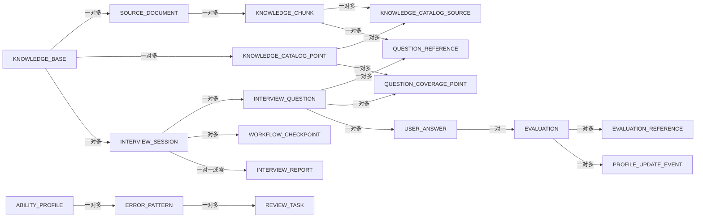
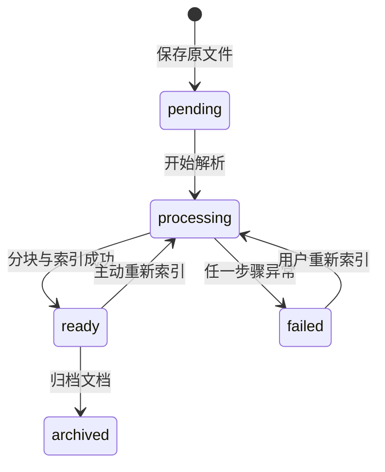
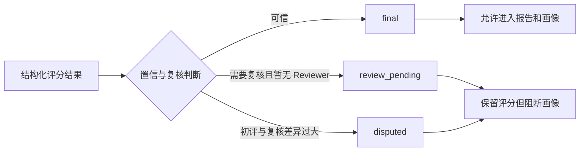
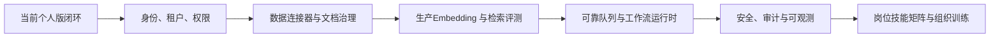

# AgentMentor V2 项目掌握与源码走读手册

> 文档定位：面向项目作者的高强度学习手册。你不需要通读全部源码，而是通过“图片理解结构、文字理解取舍、关键代码确认实现”掌握项目。  
> 使用目标：能够独立介绍项目、解释四条核心链路、回答工程化追问、指出真实边界，并在必要时定位源码。  
> 代码口径：以当前 V2 源码为准；代码片段只保留决定业务行为的部分，省略普通 DTO、CRUD 和展示代码。

---

## 0. 这份手册怎么用

### 0.1 不需要做到什么

你不需要：

- 背诵所有类名、字段和方法；
- 熟悉每个 FastAPI 路由的请求模型；
- 逐行阅读 React、CSS、Alembic 和普通 CRUD；
- 记住代码行号；
- 把尚未实现的企业级能力包装成现状。

### 0.2 必须做到什么

对每条核心链路，你需要回答六个问题：

1. 业务目的是什么？
2. 输入和输出是什么？
3. 核心处理经过哪些模块？
4. 为什么这样设计？
5. 失败、重复或低置信时怎么办？
6. 当前实现的边界是什么？

### 0.3 推荐学习方法

每一章按以下顺序学习：

```text
先看图形成整体印象
    ↓
阅读“先说结论”和步骤说明
    ↓
阅读关键代码，只理解判断和状态变化
    ↓
合上文档，用自己的话复述 3 分钟
    ↓
完成章节末尾自测题
```

你第一次阅读只看图和结论，第二次再看代码，第三次只做自测。不要第一次就陷入实现细节。

---

## 1. 项目介绍：你首先要会讲什么

### 1.1 一句话版本

AgentMentor 是一个面向个人学习者的 AI 面试训练系统：它将学习资料构建为可引用知识库，通过 RAG 生成问题和答案，再使用可信评分更新两层能力画像、知识覆盖状态与复习任务，形成“补缺 + 查漏”的下一轮训练闭环。

### 1.2 一分钟版本

> 我开发 AgentMentor 的背景是从 Java 后端转向 AI Agent 开发。我发现单纯让大模型充当面试官存在两个问题：回答是否正确难以验证，一次会话结束后也无法形成长期能力记录。  
> 因此这个项目先将 Markdown、TXT、PDF 和 DOCX 学习资料解析、切分并写入 PostgreSQL/pgvector，通过全文检索、向量检索和 RRF 生成可溯源上下文；在此基础上生成面试题、参考答案和 Rubric。用户回答后，系统进行正确性、完整性、推理和表达四维评分，并通过引用白名单和置信状态控制哪些评分可以进入画像。可信结果会更新“稳定主题 + 动态诊断子知识点”两层画像，题目实际引用的资料切片还会更新独立的知识覆盖状态，从而区分“回答得不好”和“尚未考到”，再生成复习任务与查漏计划反哺下一轮训练。
> 工程上重点实现了幂等答题、checkpoint、失败降级、报告历史和本机用户长期画像，并约束系统可在 16GB 普通开发机通过 Docker Compose 运行。

### 1.3 三分钟版本的讲述结构

不要按 Phase 顺序讲，应按“问题—方案—难点—结果—边界”讲：

1. **问题**：通用大模型的回答难验证，模拟面试缺少长期闭环；
2. **方案**：RAG 前置，资料同时支撑问答与面试出题；
3. **难点**：检索可信、评分可信、状态恢复、画像不被噪声污染；
4. **结果**：知识入库、RAG、面试、报告、画像、复习任务完整跑通；
5. **取舍**：单机用户、本地 BGE Embedding、PostgreSQL 一体化；
6. **边界**：不是 LangGraph 运行时、没有 OCR/版面模型、不是企业多租户系统。

### 1.4 项目的真正亮点

| 亮点 | 不是简单的什么 | 真正体现的能力 |
|---|---|---|
| RAG 前置 | 上传文件后聊天 | 证据召回、引用校验与拒答边界 |
| 面试状态机 | 连续调用三次接口 | 人机中断、checkpoint、幂等推进 |
| 可信评分 | LLM 随便给一个分 | Rubric、应用层重算、复核路由 |
| 两层画像 | 展示几个百分比 | 稳定统计节点与动态诊断证据分离 |
| 知识查漏 | 上传新资料后统一降分 | 增量知识目录、切片来源与可信覆盖证据分离 |
| 复习闭环 | 固定推荐列表 | 错误驱动任务、连续验证后完成 |
| 本地资源约束 | 少装几个组件 | 对成本、复杂度和可替换边界的控制 |

---

## 2. 总体架构：先建立系统地图


### 2.1 这张图需要看懂什么

系统按职责分为六层：

| 层 | 责任 | 代表代码 |
|---|---|---|
| 交互层 | 用户操作、状态展示、恢复本地选择 | `frontend/src/components/` |
| 接口层 | HTTP 协议、参数校验、响应转换 | `src/agent_mentor/api/` |
| 应用服务层 | 编排业务流程和事务边界 | `src/agent_mentor/application/` |
| 领域/RAG 层 | 不依赖 Web 的业务规则和检索算法 | `domain/`、`rag/`、`workflows/` |
| 基础设施层 | PostgreSQL、pgvector、HTTP、文件卷 | `infrastructure/` |
| 部署层 | db、api、frontend 三容器 | `docker-compose.yml` |

最重要的规则是：

> API 不承担核心业务规则；LLM 不决定最终业务状态；Infrastructure 可以替换；Application Service 是当前真正的编排中心。

### 2.2 请求是如何穿过各层的

以 RAG 问答为例：

```text
React RagPanel
  → POST /knowledge-bases/{id}/ask
  → api/chat.py
  → AnswerService.answer
  → KnowledgeRetriever Port
  → PostgresHybridRetriever
  → LLMGateway
  → AnswerService 校验并持久化
  → API Response
  → React 展示答案与引用
```

### 2.3 为什么采用这种分层

- 业务规则可以脱离 FastAPI 做单元测试；
- LLM、Embedding 和 Retriever 通过 Port/Gateway 隔离；
- 将来替换生产模型时不需要改写画像和面试规则；
- 事务集中在 Service 中，避免 Router 同时处理协议、数据库和业务；
- 对个人项目而言比微服务更容易运行和解释。

### 2.4 当前真实边界

- 这是模块化单体，不是微服务；
- 默认是本机用户，不包含企业认证和租户隔离；
- `InterviewService` 是工作流执行中心，不是 LangGraph Runtime；
- PostgreSQL 同时承担事务、全文与向量检索，适合当前规模。

### 2.5 本章必须记住

1. Router 负责协议，Service 负责编排，Domain 负责规则，Infrastructure 负责外部能力。
2. LLM 是受约束的能力提供方，不是系统最终裁判。
3. 当前架构追求的是完整闭环和本地可运行，而不是组件数量。

---

## 3. 核心数据模型：只理解关系，不背表结构



### 3.1 三组核心实体

#### 知识数据

```text
KnowledgeBase
└── SourceDocument：原始文件、版本、可信等级、状态
    └── KnowledgeChunk：分块文本、标题路径、页码、向量、全文索引

KnowledgeCatalogPoint：知识库内稳定的待验证知识点
└── KnowledgeCatalogSource：知识点与 Document/Chunk 的来源关系
```

#### 面试和评分数据

```text
InterviewSession
├── InterviewQuestion
│   ├── QuestionReference → KnowledgeChunk
│   ├── QuestionCoveragePoint → KnowledgeCatalogPoint
│   └── UserAnswer
│       └── Evaluation
│           └── EvaluationReference → KnowledgeChunk
├── WorkflowCheckpoint
└── InterviewReport
```

#### 长期画像数据

```text
Evaluation
└── ProfileUpdateEvent：记录是否应用以及变更内容
    ├── AbilityProfile：主题或子知识点掌握度
    ├── ErrorPattern：重复错误模式
    └── ReviewTask：待复习与验证状态
```

### 3.2 为什么需要 ProfileUpdateEvent

它不是多余的日志，而是画像副作用的审计记录：

- 同一 Evaluation 是否已经应用；
- 为什么跳过更新；
- 更新前后掌握度如何变化；
- 使用的是哪一版层级模型；
- 历史数据回放能否保持幂等。

### 3.3 本章必须记住

1. Chunk 是知识引用的最小单位，不能随便删除重建 ID。
2. Evaluation 是报告和画像之间的可信门禁。
3. Checkpoint 记录工作流轨迹，Idempotency-Key 保护答题副作用。
4. 掌握度描述回答质量，覆盖度描述资料中的知识是否被真实考查，二者不能混为一个分数。

---

## 4. 核心闭环：整套项目是如何串起来的


### 4.1 先说结论

项目不是六个独立页面，而是一条数据闭环：

```text
学习资料成为证据
→ 证据支撑问答和面试出题
→ 用户回答产生可信评分
→ 评分沉淀能力与错误
→ 错误生成复习任务
→ 画像推荐下一轮训练主题
```

### 4.2 两条消费路径

检索结果有两条消费者：

#### 路径 A：RAG 问答

```text
用户问题 → 检索候选 → 证据判断 → LLM 回答 → 引用校验
```

它解决“学习资料能否回答当前问题”。

#### 路径 B：模拟面试

```text
训练主题 → 检索片段 → 题目 + 参考答案 + Rubric
→ 用户回答 → 可信评分 → 画像与复习任务
```

它解决“用户是否真正掌握资料内容”。

### 4.3 画像如何反哺出题

当前真实实现是：

```text
ProfileService 生成 training focuses
→ 前端展示推荐主题和理由
→ 用户选择训练主题
→ 前端将 topic/difficulty 传入创建面试请求
→ InterviewService 结合知识库证据出题
```

必须准确表达：当前是“画像推荐 + 用户确认 + 主题注入”，不是 `InterviewService` 在后端完全自主读取画像并规划全部内容。

### 4.4 本章必须记住

1. RAG 和面试共用知识检索能力。
2. 画像只消费允许更新的评分，不消费所有 LLM 输出。
3. 复习任务和训练焦点让系统跨轮次持续工作。

---

## 5. 链路一：文档如何进入知识库


### 5.1 业务目的

将用户上传的学习资料转化为：

- 可检索的文本块；
- 可定位的引用来源；
- 可用于向量相似度的 Embedding；
- 可用于关键词匹配的 PostgreSQL `tsvector`。

### 5.2 完整调用链

```text
POST /knowledge-bases/{id}/documents
→ api/knowledge.py::upload_document
→ KnowledgeService.add_document
→ 后台调用 KnowledgeService.ingest
→ DocumentParser.parse
→ chunk_sections
→ EmbeddingGateway.embed_documents
→ KnowledgeChunkModel
→ PostgreSQL tsvector + pgvector
→ sync_document_catalog
→ KnowledgeCatalogPoint + KnowledgeCatalogSource
```

### 5.3 上传阶段做了什么

关键实现位于 `application/knowledge_service.py`：

```python
suffix = Path(filename).suffix.lower()
if suffix not in DocumentParser.supported_extensions:
    raise AppError(
        "UNSUPPORTED_DOCUMENT",
        "Only Markdown, TXT, PDF and DOCX are supported.",
    )

safe_name = Path(filename).name
digest = hashlib.sha256(content).hexdigest()

duplicate = await session.scalar(
    select(SourceDocumentModel).where(
        SourceDocumentModel.knowledge_base_id == base_id,
        SourceDocumentModel.content_hash == digest,
    )
)
if duplicate:
    return duplicate, True
```

这段代码证明了三件事：

1. 文件类型由后端再次校验，不能只信任前端；
2. `Path(filename).name` 避免直接使用带路径的上传文件名；
3. 同一知识库内使用内容 SHA-256 去重。

同名但内容不同的文件会形成新版本，旧版本被设为非活动状态。这比简单覆盖更适合知识追踪。

### 5.4 摄入阶段做了什么

```python
drafts = chunk_sections(
    self._parser.parse(filename, data),
    self._chunk_size,
    self._chunk_overlap,
)

vectors = []
for start in range(0, len(drafts), self._batch_size):
    vectors.extend(
        await self._embedding.embed_documents(
            [draft.content for draft in drafts[start:start + self._batch_size]]
        )
    )
```

这里将“解析、分块、向量化”分开，意味着后续可以分别替换解析器、分块策略和 Embedding，而不改变知识库 API。

### 5.5 为什么重新索引尽量保留 Chunk ID

```python
existing_chunks = {
    chunk.chunk_index: chunk
    for chunk in existing_chunk_rows
}

for draft, vector in zip(drafts, vectors, strict=True):
    chunk = existing_chunks.pop(draft.chunk_index, None)
    if chunk is None:
        session.add(KnowledgeChunkModel(...))
    else:
        chunk.content = draft.content
        chunk.heading_path = draft.heading_path
        chunk.embedding = vector
```

历史面试题和评分可能引用 Chunk ID。如果每次重建都删除全部 Chunk，历史引用会失效。当前方案优先按 `chunk_index` 更新原记录，从而尽量保持引用稳定。

边界是：如果文档大幅重排，相同 `chunk_index` 可能已经不是同一语义。企业化版本应增加内容指纹、结构路径匹配和文档版本化引用。

### 5.6 文档状态



系统启动时还会检查长时间遗留的 `pending/processing` 文档，避免界面永远显示处理中。但这属于中断检测和状态修复，不是从解析中间步骤自动续跑。

### 5.7 新文档如何进入查漏目录

摄入完成后，`application/coverage_catalog.py::sync_document_catalog` 会从结构化 `heading_path` 提取稳定知识点，并建立知识点到文档、切片的来源关系：

```text
SourceDocument
→ KnowledgeChunk.heading_path
→ KnowledgeCatalogPoint
→ KnowledgeCatalogSource(document_id, chunk_id)
```

关键约束：

- 当文档存在二级标题时，一级标题只作为主题容器，不作为待考子知识点；
- 同一知识库内标题规范化后生成稳定 `point_key`，重新索引不会重复创建节点；
- 新文档只增加 `uncovered` 知识点，不写入 Evaluation，也不修改既有画像；
- 文档归档时删除有效来源关系，失去活动来源的知识点不会继续参与覆盖统计；
- 服务启动会为旧文档回填目录，并通过历史 `QuestionReference` 回填题目覆盖关系。

因此，重新导入资料不是“清空画像重新训练”，而是给已有知识边界增加新的待验证集合。

代码路线：

```text
KnowledgeService.ingest
→ sync_document_catalog
→ InterviewService._create_question
→ map_question_coverage
→ ProfileService.get_coverage
→ ProfileService.recommend_interview_plan
```

### 5.8 当前能力边界

已经实现：

- Markdown、TXT、文本型 PDF、DOCX；
- 标题、段落、列表、代码、表格等基础结构抽取；
- heading path、page number、chunk index；
- 内容去重、文档版本、批量 Embedding；
- 失败状态和重新索引。

尚未实现：

- OCR；
- 多栏阅读顺序恢复；
- 复杂表格结构重建；
- 图片和图表理解；
- 企业文档 ACL 与生命周期同步。

### 5.9 自测题

1. 为什么同名文件不能直接覆盖？
2. 为什么 Chunk ID 稳定会影响历史报告？
3. BackgroundTasks 与可靠消息队列有什么区别？
4. 扫描 PDF 为什么不是换一个 Loader 就能彻底解决？
5. 为什么新文档增加知识点时不应该降低已有画像分？
6. 为什么题目只有实际引用对应 Chunk 才能计入知识覆盖？

---

## 6. 链路二：混合检索与可信 RAG 回答

### 6.1 先说结论

当前检索不是只有 pgvector，而是：

```text
向量召回
   ┐
   ├→ RRF 排名融合 → 每文档限额/相邻块去重 → Top K
全文召回
   ┘
```

### 6.2 为什么需要两路检索

- 向量检索适合语义改写，例如“如何恢复中断的 Agent 流程”；
- 全文检索适合类名、异常名、API 名称，例如 `WorkflowCheckpointModel`；
- 技术资料同时包含自然语言和精确标识符，单路召回容易漏失。

### 6.3 检索代码如何工作

`infrastructure/retriever.py` 的核心流程：

```python
vector_candidates = await self._vector_candidates(session, query, normalized)
text_candidates = []
if query.mode is RetrievalMode.HYBRID:
    text_candidates = await self._text_candidates(session, query, normalized)

vector_ranks = {item.chunk.id: item.rank for item in vector_candidates}
text_ranks = {item.chunk.id: item.rank for item in text_candidates}

fused = reciprocal_rank_fusion([list(vector_ranks), list(text_ranks)])
ordered_ids = sorted(fused, key=lambda chunk_id: fused[chunk_id], reverse=True)
```

RRF 的实现很小：

```python
def reciprocal_rank_fusion(ranked_lists, *, rrf_k=60):
    scores = {}
    for ranked in ranked_lists:
        for rank, chunk_id in enumerate(ranked, start=1):
            scores[chunk_id] = scores.get(chunk_id, 0.0) + 1.0 / (rrf_k + rank)
    return scores
```

RRF 使用排名而不是直接相加原始分数，因为全文相关度和余弦相似度不在同一尺度上。

### 6.4 向量和全文查询的真实实现

```python
# pgvector 余弦距离
vector = await self._embedding.embed_query(normalized)
distance = KnowledgeChunkModel.embedding.cosine_distance(vector)
statement = self._base_query(query).order_by(distance).limit(query.candidate_k)

# PostgreSQL 全文检索
ts_query = func.websearch_to_tsquery("simple", normalized)
rank_expr = func.ts_rank_cd(KnowledgeChunkModel.search_text, ts_query)
statement = (
    self._base_query(query)
    .where(KnowledgeChunkModel.search_text.op("@@")(ts_query))
    .order_by(rank_expr.desc())
)
```

`_base_query` 只读取当前知识库、READY 且 active 的文档，并支持可信等级过滤。这是检索的业务边界。

### 6.5 当前 Embedding 的准确口径

当前默认链路已经切到本地 `BgeEmbeddingGateway`，模型为 `BAAI/bge-small-zh-v1.5`，输出 512 维向量并写入 pgvector。它解决的是早期特征哈希只能捕获字面相似的问题，让中文学习资料的语义召回更接近真实使用场景。

```python
if settings.embedding_provider is EmbeddingProvider.BGE:
    embedding = BgeEmbeddingGateway(
        model_name=settings.embedding_model or "BAAI/bge-small-zh-v1.5",
        dimension=settings.embedding_dimension,
        batch_size=settings.embedding_batch_size,
    )
else:
    embedding = DevelopmentEmbeddingGateway(settings.embedding_dimension)
```

项目仍保留 `DevelopmentEmbeddingGateway` 作为测试和无模型环境 fallback。它是确定性的特征哈希基线：

```python
words = re.findall(r"[a-z0-9_]{2,}", normalized)
chinese_segments = re.findall(r"[\u4e00-\u9fff]+", normalized)
chinese_ngrams = [
    segment[index:index + size]
    for segment in chinese_segments
    for size in (2, 3)
    for index in range(max(0, len(segment) - size + 1))
]
```

然后使用 BLAKE2b 将特征映射到固定维度并做 L2 归一化。

BGE 链路的价值：

- 中文语义召回能力明显强于特征哈希；
- 与 pgvector 真实集成，检索评估可以复现；
- 本机 CPU / Docker 环境可运行，符合个人项目演示约束；
- 通过 `EmbeddingGateway` 端口隔离，后续可以继续替换云 Embedding 或 reranker。

Development fallback 的价值：

- 不下载本地大模型；
- 资源占用稳定；
- 离线可运行；
- 测试结果确定。

当前限制：

- BGE-small-zh 是本地轻量语义模型，不等同于企业级向量服务；
- 没有做多模型版本共存和在线向量迁移，历史向量采用重建式方案处理；
- 还没有接入 reranker、权限过滤、多租户索引隔离等企业化能力。

面试中应该说：“当前默认使用 BGE-small-zh + pgvector，采用重建式切换并保留 development fallback；它已经比早期开发基线更接近真实语义检索，但不能夸大成企业级向量检索平台。”

### 6.6 RAG 如何执行证据门禁

`AnswerService.answer` 的关键判断：

```python
sufficient = (
    bool(candidates)
    and candidates[0].score >= self._min_evidence_score
    and self._has_lexical_support(question, candidates)
)

if not sufficient and not allow_model_knowledge:
    return await self._persist(
        answer="当前知识库证据不足，我不能把模型常识伪装成资料结论。",
        citations=[],
        evidence_sufficient=False,
        generation_mode="evidence_guard",
        fallback_reason="insufficient_evidence",
    )
```

这段代码体现的不是“模型不知道就不回答”，而是应用层先判断当前资料是否足以支持回答。

### 6.7 引用白名单

```python
def validate_citations(citation_ids, context):
    allowed = {chunk.chunk_id for chunk in context}
    invalid = [chunk_id for chunk_id in citation_ids if chunk_id not in allowed]
    if invalid:
        raise ValueError("Citations are not in the current retrieval context")
```

它能防止模型编造一个不存在或不属于本轮上下文的 Chunk ID。

它不能证明：

- 片段完整支持答案中的所有 claim；
- 文档本身一定正确；
- 检索没有漏掉关键证据；
- 模型没有曲解原文。

所以准确表述是“引用来源合法性校验”，不是“完全消除幻觉”。

### 6.8 检索结果为什么还要限额和去邻接块

Retriever 会限制单文档贡献的 Chunk 数，并避免连续相邻块挤占全部 Top K。目的是提高来源多样性，防止一篇长文档独占上下文。

这仍是启发式规则。企业化阶段应该基于标注集测量 Recall@K、MRR/NDCG 和引用正确率，再决定候选数、权重与 reranker。

### 6.9 自测题

1. 为什么全文分数和向量分数不能直接相加？
2. RRF 解决了什么，又没有解决什么？
3. 引用白名单为什么不等于事实正确性校验？
4. 当前 Embedding 为什么适合 Demo，但不能包装成生产模型？

---

## 7. 链路三：可恢复模拟面试工作流


### 7.1 业务目的

面试不是一次同步调用，因为系统必须在出题后暂停，等待用户可能几分钟甚至更久的输入。它需要：

- 保存当前题目和进度；
- 防止重复提交；
- 刷新后恢复；
- 记录关键节点；
- 最后一题后进入完成状态。

### 7.2 状态流

```text
created
→ load_profile 语义节点
→ plan_interview
→ generate_question
→ waiting_for_answer
→ persist_answer
→ advance_question → generate_question（未完成）
→ finish_interview（最后一题）
→ completed
```

### 7.3 启动面试的代码

```python
assert_transition(interview.status, InterviewStatus.WAITING_FOR_ANSWER)
interview.status = InterviewStatus.WAITING_FOR_ANSWER

await self._checkpoint(db, load_profile(self._state(interview, "load_profile")))
await self._checkpoint(db, plan_interview(self._state(interview, "plan_interview")))
question = await self._create_question(db, interview, sequence=1)
await self._checkpoint(
    db,
    wait_for_answer(generate_question(self._state(interview, "generate_question"))),
)
await db.commit()
```

这说明 checkpoint 和业务状态在同一事务中提交，避免页面看到已推进状态但 checkpoint 缺失。

### 7.4 幂等答题

```python
existing = await db.scalar(
    select(UserAnswerModel).where(
        UserAnswerModel.question_id == question_id,
        UserAnswerModel.idempotency_key == idempotency_key,
    )
)
if existing is not None:
    return await self._snapshot(db, interview)
```

随后才校验：

- 问题是否属于当前面试；
- 面试是否正在等待回答；
- 是否是当前题目；
- 最后一题完成还是生成下一题。

应用查询负责友好返回，数据库唯一约束负责并发下的最终防线。只在前端禁用按钮不能处理网络重试和并发请求。

### 7.5 checkpoint 能做什么

- 记录每场面试经过的节点；
- 保存题目索引、总题数和等待状态；
- 为前端展示工作流轨迹；
- 刷新后通过服务端会话恢复当前题目；
- 帮助定位流程停在哪一步。

### 7.6 checkpoint 不能做什么

- 不能从任意 Python 语句自动续跑；
- 没有分布式任务租约和节点调度；
- 没有通用工作流引擎的自动重试和补偿；
- `load_profile` 当前主要表达语义与轨迹，不是在后端自动读取完整画像。

因此准确口径是：

> 当前使用显式工作流节点、checkpoint 和 Service 编排实现可恢复的人机工作流；它借鉴图工作流思想，但不是 LangGraph 运行时。

### 7.7 题目是如何生成的

`InterviewService._create_question` 会结合：

- 面试主题；
- 难度；
- 题型；
- 知识库检索片段；
- 本轮已经出现的问题。

输出包含：

- question；
- reference answer；
- required knowledge points；
- Rubric；
- reference chunks。

当前支持本轮相似题规避，但没有对所有历史题目建立跨轮语义去重索引。

### 7.8 自测题

1. 为什么面试不能设计成一个长同步接口？
2. checkpoint 与数据库业务状态有什么区别？
3. Idempotency-Key 为什么还需要数据库唯一约束？
4. 为什么不能在简历中写“基于 LangGraph 完成工作流编排”？

---

## 8. 链路四：可信评分、报告与画像门禁


### 8.1 先说结论

LLM 只提供结构化评分建议，应用层负责：

- 校验 Rubric；
- 校验引用白名单；
- 重新计算总分；
- 决定 final、review_pending 或 disputed；
- 控制结果是否允许更新画像。

### 8.2 四维评分

| 维度 | 关注内容 | 常见扣分原因 |
|---|---|---|
| correctness | 结论与核心事实 | 概念混淆、错误断言 |
| completeness | 必答点覆盖 | 漏掉边界、风险或关键步骤 |
| reasoning | 推理和因果 | 只给结论、因果不成立 |
| communication | 面试表达 | 结构混乱、术语堆砌 |

### 8.3 评分代码中的可信约束

```python
allowed_references = await self._question_reference_ids(db, question.id)
output = await self._evaluate_with_llm_or_fallback(
    question,
    answer,
    allowed_references,
)
self._assert_allowed_references(output.reference_chunk_ids, allowed_references)

reasons = review_reasons_for(output)
status, review_decision = initial_review_route(
    output,
    reviewer_available=reviewer_available,
)
```

最终分不直接读取模型返回的 `total`：

```python
evaluation = EvaluationModel(
    correctness=output.correctness,
    completeness=output.completeness,
    reasoning=output.reasoning,
    communication=output.communication,
    total=total_score(output),
    confidence=output.confidence,
    status=status,
)
```

这样可以保证总分与四维分数一致，并让评分规则可测试、可版本化。

### 8.4 三种状态



重要区别：`review_pending` 和 `disputed` 不是前端标签，而是下游副作用门禁。

### 8.5 报告为什么需要逐题解析

总分只能告诉用户结果，不能指导学习。逐题报告需要回答：

- 为什么得这个分；
- 覆盖了哪些知识点；
- 缺失了哪些必答点；
- 存在哪些错误断言；
- 怎样重新组织答案；
- 是否建议追问或复习。

报告历史和趋势让用户观察多轮变化，但趋势不是画像本身：报告表示某场表现，画像表示跨多次可信证据的渐进估计。

### 8.6 同一模型出题和评分的偏差

当前系统通过 Rubric、确定性总分、引用白名单和复核状态降低风险，但不能完全消除：

- 模型偏爱自己生成的参考答案；
- Rubric 可能遗漏其他正确解法；
- 同源提示可能产生一致但错误的判断；
- 表达风格偏好可能被误认为能力差异。

企业化方案包括独立 Reviewer、人工校准集、模型间交叉评审和评分一致性指标。当前应该描述为“可信性增强”，而不是“绝对客观评分”。

### 8.7 自测题

1. 为什么最终总分不能由 LLM 直接决定？
2. `review_pending` 为什么不能更新画像？
3. 逐题解析比总分多解决了什么问题？
4. 同源模型评分偏差如何缓解？

---

## 9. 两层能力画像与复习任务


### 9.1 为什么旧画像会出现问题

如果直接把每道题的文本作为知识点，大模型每次换一种措辞就会产生新节点：

```text
RAG 包含检索和生成两个阶段
RAG 检索增强生成
检索阶段使用 Query 与 Key 匹配
生成阶段使用检索 Value
```

最终界面会出现大量重复碎片，无法回答“用户整体 RAG 能力如何变化”。

### 9.2 两层模型

#### 第一层：稳定主题

例如：

- RAG；
- LangGraph；
- Agent 工程；
- Java 后端。

它们适合长期趋势和下一轮主题选择。

#### 第二层：动态诊断子知识点

例如：

- 混合检索与 RRF；
- 状态建模与恢复；
- 引用与证据边界；
- 工具选择和参数校验。

它们用于解释具体薄弱点、错误模式和复习任务。

核心思想是：

> 稳定节点用于统计，动态证据用于诊断。

### 9.3 哪些评分允许更新画像

领域规则位于 `domain/profile.py`：

```python
def profile_update_decision(status: str, confidence: float):
    if status in {EvaluationStatus.DISPUTED, EvaluationStatus.REVIEW_PENDING}:
        return ProfileUpdateDecision(
            should_update=False,
            reason=f"skip_{status}",
            confidence_weight=0,
        )
    if confidence < 0.70:
        return ProfileUpdateDecision(
            should_update=True,
            reason="low_confidence_final",
            confidence_weight=0.5,
        )
    return ProfileUpdateDecision(
        should_update=True,
        reason="trusted_final",
        confidence_weight=1.0,
    )
```

规则含义：

- disputed/review_pending：完全阻断；
- 低置信 final：允许更新，但权重减半；
- 可信 final：完整权重更新。

### 9.4 为什么高分后画像不会立刻满分

```python
def updated_mastery(current_mastery, score, *, confidence_weight, difficulty):
    difficulty_factor = {
        "easy": 0.85,
        "medium": 1.0,
        "hard": 1.15,
    }.get(difficulty, 1.0)
    learning_rate = min(0.35, 0.18 * confidence_weight * difficulty_factor)
    return round(
        current_mastery + (score - current_mastery) * learning_rate,
        4,
    )
```

这是渐进更新：

```text
新掌握度 = 旧掌握度 + (本次得分 - 旧掌握度) × 学习率
```

一次高分只能将画像向高分方向移动，不能覆盖全部历史。这可以降低参考答案演示、偶然命题和评分波动的影响。

### 9.5 ProfileService 如何应用评分

```python
decision = profile_update_decision(evaluation.status, evaluation.confidence)
topic = canonical_topic(interview_topic)
subtopics = canonical_subtopics(
    topic,
    question.knowledge_points,
    question_type=question.question_type,
)

if not decision.should_update:
    # 记录未应用的 ProfileUpdateEvent，然后返回
    return

for node in (topic, *subtopics):
    profile.mastery_score = updated_mastery(
        profile.mastery_score,
        normalized_score(evaluation.total),
        confidence_weight=decision.confidence_weight,
        difficulty=question.difficulty,
    )
```

这段代码证明画像同时更新主题和规范化子知识点，并把决策记录到事件中。

### 9.6 复习任务为什么需要两次验证

```python
def review_verification_progress(current_streak, priority, *, trusted_high_score):
    if not trusted_high_score:
        return 0, priority, False
    next_streak = min(2, current_streak + 1)
    return next_streak, max(1, priority - 1), next_streak >= 2
```

- 第一次可信高分：`verification_streak = 1`，任务仍保留；
- 第二次连续可信高分：任务完成；
- 中间低分或不可信结果：连续计数重置或不推进。

这是为了避免一次偶然高分直接抹掉长期错误证据。

### 9.7 训练焦点如何排序

复习任务比普通低掌握度画像优先，因为它代表近期已经观察到的具体错误；之后补充知识覆盖缺口，再考虑低掌握度能力。高掌握度能力不会再使用 `low_mastery` 作为推荐理由。

当前推荐语义是：

```text
近期明确错误（补缺）
→ 未覆盖或证据不足的目录点（查漏）
→ 低掌握度稳定主题
→ 后续维护或扩展训练
```

### 9.8 掌握度和覆盖度为什么必须分开

两层画像回答的是“用户在已经回答过的问题上表现如何”；知识覆盖回答的是“知识库中的内容是否被实际验证”。未考到不能解释为不会，也不能默认解释为掌握。

覆盖状态由 `ProfileService.get_coverage` 根据真实数据计算：

| 状态 | 含义 |
|---|---|
| `uncovered` | 已有活动资料来源，但没有题目实际引用 |
| `attempted` | 已经出题，但还没有可信评分 |
| `insufficient_evidence` | 只有一次可信验证，证据不足 |
| `verified` | 已有多次可信证据，表现中等 |
| `mastered` | 至少两次可信验证，平均分达到阈值 |
| `weak` | 已有多次可信验证，但平均表现较弱 |

可信覆盖要求 Evaluation 为 `final` 且 `confidence >= 0.70`。`review_pending`、`disputed` 和低置信结果不会让目录点变成已验证。

完整证据链是：

```text
SourceDocument
→ KnowledgeChunk
→ KnowledgeCatalogSource
→ QuestionReference
→ QuestionCoveragePoint
→ Evaluation
```

这条链路防止系统仅因为题目文本提到了某个名词，就错误声称已经考查了对应资料。

### 9.9 自测题

1. 为什么画像分不等于最近一次面试分？
2. 主题与子知识点分别解决什么问题？
3. 为什么低置信 final 可以降权更新，而 pending 必须阻断？
4. 连续两次验证比一次高分有什么价值？
5. 为什么 `uncovered` 是“未知”而不是“低掌握度”？
6. 上传新文档后，覆盖数和画像分分别应该如何变化？

---

## 10. 五个最能体现工程能力的专题

### 10.1 幂等不等于按钮防抖

按钮防抖只处理用户快速点击；Idempotency-Key 处理客户端重试；数据库唯一约束处理并发竞态。三者不在同一层。

面试回答模板：

> 前端会复用同一道题的稳定幂等键，API 将其传给 `InterviewService`。服务先查询已有答案，数据库再通过唯一约束承担并发下的最终防线，因此响应丢失后的重试不会重复写入或推进题目。

### 10.2 checkpoint 不等于完整工作流引擎

当前 checkpoint 已经让流程可观测、可恢复到业务状态，但没有任务租约、分布式调度和节点级补偿。

面试回答模板：

> 我先把状态、节点、幂等和恢复语义做实，当前由 Service 显式编排。流程规模增大后可以迁移到 LangGraph 或其他工作流引擎，但不能为了框架名称把当前实现描述成 LangGraph Runtime。

### 10.3 降级必须可观测

无 API Key、LLM 失败或证据不足时，系统仍可用确定性路径完成演示，但必须记录：

- generation mode；
- model name；
- fallback reason；
- runtime 当前模式。

否则 fallback 会让人误以为真实模型已经调用成功。

### 10.4 事务边界比“调用顺序正确”更重要

以下内容需要在同一业务事务内保持一致：

- 答案写入、面试进度和 checkpoint；
- Evaluation 与引用记录；
- 画像更新与 ProfileUpdateEvent；
- 报告创建或更新。

### 10.5 历史可追溯需要稳定标识和版本

- 文档使用内容 Hash 和版本；
- Chunk 重建尽量保留 ID；
- Evaluation 保存模型和 Prompt 版本；
- 画像更新保存 hierarchy version 和变化详情；
- 报告保留多轮历史。

这些是系统能够解释“这个结果从哪里来”的基础。

---

## 11. 八个故障场景：必须会回答

| 场景 | 当前处理 | 仍然存在的边界 |
|---|---|---|
| 重复提交答案 | 幂等键查询 + DB 唯一约束 | 不代表所有并发操作都自动串行 |
| 页面刷新 | 服务端面试状态 + checkpoint；前端按知识库恢复 | 浏览器本地状态丢失时仍依赖服务端 ID |
| 文档处理中 API 重启 | 启动扫描遗留状态并标记可处理 | 不能从解析中间步骤续跑 |
| LLM 无 Key | 确定性 fallback，运行态显示降级 | 只能验证工程链路，不能验证模型质量 |
| 证据不足 | evidence guard 明确拒答 | 阈值仍需评测集校准 |
| 报告重复生成 | 稳定报告关系，事务内更新 | 高并发仍需依赖数据库约束 |
| 文档重新索引 | 按 chunk index 更新，尽量保留 ID | 大幅重排需内容指纹和版本引用 |
| 低可信评分 | pending/disputed 阻断画像，低置信 final 降权 | 独立 Reviewer 和人工校准仍需增强 |

---

## 12. 企业级 RAG：当前项目之外必须理解什么

### 12.1 企业级难点不是只换更强模型

| 难点 | 典型问题 | 解决方向 |
|---|---|---|
| 复杂文档 | 扫描件、表格、多栏、图片、公式 | OCR、Layout、表格结构化、多模态解析 |
| 数据治理 | 重复、过期、冲突、来源不明 | 版本、有效期、权威等级、数据血缘 |
| 权限 | 检索到无权文档即已越权 | 租户 + RBAC/ABAC，召回前过滤 |
| 检索质量 | 相似不等于可回答 | 混合检索、reranker、术语库、Query Rewrite |
| 可信生成 | 有引用但不支持 claim | claim-evidence 对齐、冲突检测、拒答 |
| 评测 | 体验好无法量化 | 标注集、Recall@K、NDCG、groundedness |
| 可靠任务 | 大文件、重试、重复消息 | 队列、Worker、任务租约、幂等、死信 |
| 安全 | Prompt Injection、数据外带 | 最小权限、工具 allowlist、输出检测、审计 |
| 成本 | Embedding、rerank、LLM 成本不可控 | 缓存、模型路由、配额、成本归因 |

### 12.2 AgentMentor 企业化演进顺序



#### 第一阶段：身份和权限

- 企业 SSO/OIDC；
- tenant/user/role；
- 知识库、文档、报告和画像租户归属；
- 检索 SQL 前置 ACL；
- 跨租户越权测试和审计。

#### 第二阶段：数据和复杂文档

- 对象存储；
- Wiki、网盘、代码库等 Connector；
- 增量同步、撤回和删除传播；
- 文档版本、责任人、密级和有效期；
- OCR、版面与表格质量报告。

#### 第三阶段：检索质量

- 生产中文/多语言 Embedding；
- 向量版本和灰度重建；
- Hybrid Retrieval + Reranker；
- 业务标注集；
- 引用正确率、拒答率、P95 和成本指标。

#### 第四阶段：可靠运行

- 持久化 Job 和消息队列；
- 独立解析、Embedding、索引 Worker；
- 超时、重试、死信、人工补偿；
- Trace、指标、日志和成本归因。

#### 第五阶段：组织能力平台

- 岗位和职级技能矩阵；
- 评分人工复核与申诉；
- 团队训练计划；
- 聚合趋势与个人隐私边界；
- 模型、Prompt、Rubric 和画像算法版本管理。

### 12.3 为什么不能一开始就拆微服务

企业化的优先级应是权限、数据质量和评测证据，而不是服务数量。建议先保持模块边界，通过接口逐步替换基础设施；只有独立扩缩容、故障隔离或团队所有权出现明确需求时再拆服务。

---

## 13. 当前项目的真实边界清单

### 13.1 可以明确说“已实现”

- 四类文本型文档解析、切分和索引；
- PostgreSQL 全文检索、pgvector 向量检索和 RRF；
- 证据判断、引用白名单和拒答降级；
- 面试题、参考答案、知识点和 Rubric；
- checkpoint、答题幂等和状态恢复；
- 四维评分、应用层总分和复核状态；
- 报告历史和趋势；
- 两层画像、错误模式、复习任务和训练焦点；
- 知识库增量目录、历史引用回填和可信覆盖状态；
- 多知识库切换；
- Docker Compose 三容器和真实数据库集成测试。

### 13.2 必须附带边界说明

| 能力 | 准确表达 |
|---|---|
| Agent 工作流 | 显式节点、checkpoint、人机中断；当前由 Service 编排 |
| 画像驱动出题 | 画像推荐训练焦点，用户选择后注入主题 |
| 查漏驱动出题 | 目录缺口进入推荐计划，仍由用户选择后启动面试 |
| Embedding | 默认 BGE-small-zh，保留 development 特征哈希 fallback；非企业级向量服务 |
| 复杂文档 | 基础文本解析，不包含 OCR 与复杂版面 |
| 去重 | 文档内容去重 + 本轮题目规避，非全历史语义去重 |
| 故障恢复 | 关键业务幂等和状态恢复，非分布式任务引擎 |
| 可信评分 | 增加确定性约束，不能声称绝对客观 |
| 用户系统 | 本机默认用户，不是企业多租户系统 |

### 13.3 不要使用的表述

- “完全杜绝幻觉”；
- “基于 LangGraph 实现完整自主 Agent”；
- “支持所有复杂 PDF”；
- “企业级向量服务 / 已完成生产级 Embedding 治理”；
- “画像准确代表用户真实能力”；
- “企业级权限和分布式恢复已完成”。

---

## 14. 最小源码定位表

你不需要阅读全部源码，但应知道问题落在哪里。

| 问题 | 第一定位 | 第二定位 |
|---|---|---|
| 文档如何上传和去重 | `application/knowledge_service.py` | `api/knowledge.py` |
| 如何解析和分块 | `rag/documents.py` | `rag/chunking.py` |
| 向量如何生成 | `infrastructure/embedding.py` | `ports/embedding_gateway.py` |
| 混合检索如何实现 | `infrastructure/retriever.py` | `rag/retrieval.py` |
| 如何拒绝无证据回答 | `application/answer_service.py` | `api/chat.py` |
| 面试如何推进 | `application/interview_service.py` | `domain/interview.py` |
| checkpoint 定义 | `workflows/interview.py` | `database/models.py` |
| 答题幂等 | `application/interview_service.py` | `database/models.py` |
| 评分和报告 | `application/evaluation_service.py` | `domain/evaluation.py` |
| 两层画像 | `application/profile_service.py` | `domain/profile_taxonomy.py` |
| 画像更新权重 | `domain/profile.py` | `application/profile_service.py` |
| 增量知识目录 | `application/coverage_catalog.py` | `application/knowledge_service.py` |
| 题目如何形成覆盖证据 | `application/interview_service.py` | `database/models.py` |
| 覆盖状态和查漏推荐 | `application/profile_service.py` | `api/profiles.py` |
| 前端覆盖摘要 | `frontend/src/components/ProfilePanel.jsx` | `frontend/src/main.jsx` |
| 运行态与演示检查 | `api/health.py` | `application/demo_readiness_service.py` |
| 完整集成证明 | `tests/integration/test_learning_loop.py` | `tests/unit/` |

---

## 15. 推荐的七天学习计划

### 第 1 天：只掌握项目地图

- 阅读第 1～4 章；
- 不看代码；
- 画出总体架构和核心闭环；
- 完成一分钟和三分钟项目介绍。

验收：不看文档讲清楚为什么做、怎么做、亮点和边界。

### 第 2 天：知识入库

- 学习第 5 章；
- 理解状态、去重、版本和重新索引；
- 回答四道自测题。

验收：能说明一个 PDF 如何变成可引用 Chunk。

### 第 3 天：RAG 检索

- 学习第 6 章；
- 手写 RRF 公式；
- 区分引用合法与事实正确；
- 讲清当前 Embedding。

验收：能解释为什么使用全文 + 向量，而不是只用一个。

### 第 4 天：面试工作流

- 学习第 7 章；
- 画状态图；
- 讲清 checkpoint 与幂等；
- 明确非 LangGraph 运行时。

验收：能回答刷新、重复提交和最后一题如何处理。

### 第 5 天：评分和画像

- 学习第 8～9 章；
- 记住三种评分状态；
- 手算一次渐进掌握度；
- 解释连续两次验证。

验收：能回答“为什么高分后画像仍然是 50 分”。

### 第 6 天：工程化和企业化

- 学习第 10～13 章；
- 针对八个故障场景口述答案；
- 画出企业化五阶段路线。

验收：能区分当前实现、轻量取舍和企业增强。

### 第 7 天：模拟面试

- 使用 `agentmentor-v2-interview-qa.md`；
- 每题先自己回答，再对照专家答案；
- 每道题限制 3 分钟；
- 把回答录音并纠正夸大表述。

验收：13 组题中至少 10 组能独立回答，且能指出对应代码模块。

---

## 16. 最终自测清单

### 项目介绍

- [ ] 能用一分钟讲清项目；
- [ ] 能解释与 ChatGPT/Codex 对话的区别；
- [ ] 能说出三个亮点和三个真实边界。

### RAG

- [ ] 能画出文档入库链路；
- [ ] 能解释全文、向量和 RRF；
- [ ] 能准确描述当前 Embedding；
- [ ] 能解释证据门禁和引用白名单。

### Agent 工作流

- [ ] 能画出面试状态机；
- [ ] 能解释 checkpoint；
- [ ] 能解释 Idempotency-Key 和 DB 约束；
- [ ] 不会把当前实现误说成 LangGraph Runtime。

### 评分与画像

- [ ] 能解释四维 Rubric；
- [ ] 能解释为什么应用层重算总分；
- [ ] 能解释 final/pending/disputed；
- [ ] 能解释两层画像和渐进更新；
- [ ] 能解释复习任务的两次验证。

### 工程化与企业化

- [ ] 能回答八个故障场景；
- [ ] 能说明 16GB 约束下的取舍；
- [ ] 能说出企业级 RAG 的核心难点；
- [ ] 能给出渐进企业化路线；
- [ ] 能区分已实现、规划和行业通用方案。

---

## 17. 关联学习材料

| 文档 | 用途 |
|---|---|
| `docs/operations/project-handoff-v2.md` | 完整 V2 交接和代码地图 |
| `docs/interview/agentmentor-v2-interview-qa.md` | 13 组深度面试问答 |
| `docs/design/v2-two-layer-ability-profile.md` | 两层画像专项设计 |
| `docs/planning/V2开发路线与验收标准.md` | Phase 7～12 路线与验收 |
| `docs/evaluations/incremental-document-coverage-acceptance-20260802.md` | 新文档、查漏覆盖与三轮真实面试验收 |
| `docs/acceptance/` | 每阶段的实现证据和验证结果 |
| `tests/integration/test_learning_loop.py` | 完整闭环的真实数据库证据 |

---

## 18. 最后应该形成的项目认知

学习完这份手册后，你不需要成为每一行代码的作者，但必须能形成下面这段判断：

> AgentMentor 的核心价值不是“用大模型生成三道题”，而是把学习资料、可溯源检索、人机工作流、可信评分和长期画像连接成一个受约束的训练闭环。系统通过应用层规则限制 LLM 的权力，通过 checkpoint 和幂等保证流程状态，通过两层画像控制长期记忆粒度，再通过增量知识目录区分“回答得怎么样”和“资料是否考到”，形成补缺与查漏两类训练信号；并在 16GB 本地约束下选择 PostgreSQL、本地 BGE-small-zh 和模块化单体。它已经是一个真实可运行的个人学习系统，但还不是企业级终态；跨场题目去重、复杂文档、生产检索评测、租户权限和可靠异步任务是明确的演进方向。

当你能够不用原文复述这段话，并能为每个结论指出一段关键代码或一条测试证据时，就已经达到项目面试所需的掌握程度。

---

## 19. 学完文档是否等于可以面试

### 19.1 结论

只阅读并理解本文，大约完成了项目面试准备的 **70%**。它能帮助你回答架构、流程、设计和边界问题，但不能自动证明你具备以下能力：

- 能独立运行和演示系统；
- 能根据异常快速定位模块；
- 能完成一个小范围代码修改；
- 能使用真实数据说明资源、测试和效果；
- 能解释自己在 AI 辅助开发中的判断与责任；
- 能在没有标准答案时分析新问题。

因此，真正的面试就绪状态是：

```text
项目认知 40%
+ 口头表达 20%
+ 运行与排障 15%
+ 小改动能力 15%
+ 数据和证据 10%
= 项目面试就绪
```

这个比例是学习优先级，不是项目质量评分。

### 19.2 三档掌握程度

| 档位 | 表现 | 面试风险 |
|---|---|---|
| 只读懂文档 | 能复述架构和流程 | 追问实现或异常时容易卡住 |
| 文档 + 演示 | 能展示闭环和解释结果 | 现场修改与代码定位仍可能薄弱 |
| 文档 + 演示 + 小改动 | 能解释、验证、定位和修改 | 达到推荐的项目面试标准 |

### 19.3 最终验收

满足以下条件后，才建议在简历中把它作为重点项目：

- [ ] 不看文档完成 3 分钟介绍；
- [ ] 10 分钟演示完整闭环；
- [ ] 白板画出总体架构、RAG 和面试状态机；
- [ ] 解释 5 个关键取舍和 5 个真实边界；
- [ ] 面对一个错误能说出排查顺序；
- [ ] 能定位 8 个关键文件；
- [ ] 能独立完成一个小修改并补测试；
- [ ] 能回答“为什么两天开发的项目也能写简历”；
- [ ] 能用数据证明可运行，但不捏造质量指标。

---

## 20. 十分钟现场演示脚本

### 20.1 演示目标

演示不是把所有按钮点击一遍，而是证明四件事：

1. 学习资料真实进入知识库；
2. 回答和题目受到资料证据约束；
3. 面试流程可以暂停、恢复且防重复；
4. 评分会影响画像和下一轮训练。

### 20.2 演示前准备

```powershell
docker compose up -d --build
docker compose ps
Invoke-RestMethod http://localhost:8000/health/ready
Invoke-RestMethod http://localhost:8000/health/runtime
```

准备一份你真正看得懂的学习资料，建议包含：

- 一个明确概念；
- 一个执行流程；
- 一个风险或边界；
- 一个工程示例。

不要在正式演示时第一次上传未知 PDF，也不要依赖临时网络下载材料。

### 20.3 演示顺序

#### 第 1 分钟：说明问题和架构

> 这个系统不是通用聊天页面，而是把学习资料、面试训练和长期画像连接起来。资料先成为可检索证据，然后被 RAG 问答和面试出题两条路径共同消费。

展示系统状态，指出当前使用真实 LLM 还是 fallback，避免让面试官猜测。

#### 第 2～3 分钟：知识库和资料入库

- 选择已有知识库；
- 展示文档状态为 ready；
- 说明解析、分块、Embedding、全文索引；
- 可补充演示重复文件如何去重。

讲述重点：

> 后端以内容 Hash 去重，同名不同内容形成新版本；重新索引尽量保留 Chunk ID，避免破坏历史引用。

#### 第 4 分钟：RAG 问答

- 提问资料中可以回答的问题；
- 展示答案、引用和检索解释；
- 再提一个明显超出资料的问题，展示证据不足降级。

讲述重点：

> 全文和向量分别召回，RRF 基于排名融合；生成后引用必须属于本轮候选白名单。白名单保证来源合法，但不等于事实绝对正确。

#### 第 5～7 分钟：模拟面试

- 从画像推荐中选择一个训练焦点；
- 创建并启动面试；
- 展示题目、真实输入框和参考答案入口；
- 提交一题后刷新页面，证明状态可恢复；
- 说明同一道题的 Idempotency-Key。

讲述重点：

> 面试在等待回答节点暂停，答案、进度和 checkpoint 持久化；重复请求不会重复推进。

#### 第 8～9 分钟：评分和画像

- 生成评分与报告；
- 展开一道题的逐题解析；
- 展示报告历史和趋势；
- 展示稳定主题、动态子知识点和复习任务。

讲述重点：

> LLM 给出四维评分建议，应用层重算总分；pending/disputed 不更新画像，低置信 final 降权。画像渐进更新，所以一次高分不会立刻满分。

#### 第 10 分钟：主动说明边界

> 当前版本面向本机个人用户，Embedding 默认使用本地 BGE-small-zh，并保留 development fallback；复杂文档不包含 OCR，工作流由 Service 显式编排而不是 LangGraph Runtime。下一步企业化会优先补权限、数据治理、评测和可靠任务，而不是先拆微服务。

主动说明边界往往比等面试官指出更可信。

### 20.4 演示失败时如何处理

| 失败 | 现场处理 |
|---|---|
| 页面打不开 | 检查 `docker compose ps` 和 frontend 日志 |
| ready 返回 503 | 检查数据库 healthcheck 和连接配置 |
| 文档 pending | 查看 API 日志与文档错误信息，说明 BackgroundTasks 边界 |
| RAG fallback | 查看 runtime、API Key、模型地址和 fallback reason |
| 无法评分 | 检查面试是否 completed、答案是否完整 |
| 画像没变化 | 检查 Evaluation 状态和置信度，不在前端硬改分数 |

面试中遇到问题不要急于掩盖。按“现象—链路—日志—状态—依赖”的顺序排查，本身就是工程能力展示。

---

## 21. 运行、测试与排障速查

### 21.1 启停和状态

```powershell
docker compose up -d --build
docker compose ps
docker compose logs api --tail 200
docker compose logs db --tail 100
docker compose logs frontend --tail 100
docker compose down
```

### 21.2 核心验收

```powershell
Invoke-RestMethod http://localhost:8000/health/live
Invoke-RestMethod http://localhost:8000/health/ready
Invoke-RestMethod http://localhost:8000/health/runtime
docker compose exec api alembic current
docker compose exec db psql -U agentmentor -d agentmentor `
  -c "SELECT extname FROM pg_extension WHERE extname = 'vector';"
```

### 21.3 质量门禁

```powershell
python -m uv run ruff check .
python -m uv run ruff format --check .
python -m uv run pyright
python -m uv run pytest

Set-Location frontend
npm.cmd run build
```

Windows 应用控制可能阻止 Ruff 或 Pyright 可执行文件。遇到这种情况应记录为环境门禁，并优先使用容器执行，而不是把工具失败描述成代码测试通过。

### 21.4 排查顺序

```text
1. 服务是否存活：docker compose ps
2. 健康检查是否通过：live / ready / runtime
3. 业务状态是否正确：document/interview/evaluation status
4. 日志是否有异常：api/db/frontend logs
5. 数据库约束或迁移是否一致：alembic current
6. 外部依赖是否可用：LLM endpoint/API key
7. 是否走了 fallback：generation_mode/fallback_reason
8. 最后才考虑前端展示问题
```

### 21.5 测试如何分层

| 测试类型 | 适合验证 |
|---|---|
| Domain 单元测试 | 状态迁移、总分、画像权重、复习任务 |
| Service 单元测试 | fallback、白名单、幂等和门禁流程 |
| PostgreSQL 集成测试 | pgvector、全文查询、唯一约束、事务、跨表闭环 |
| 前端构建 | React 依赖、组件导入和生产 Bundle |
| Docker 验收 | 三容器、迁移、代理和真实运行环境 |

本文完成增量查漏改造后的最近一次回归结果为：Ruff 全项目通过、Pytest `56 passed / 1 skipped`、React 生产构建通过、Docker Compose 迁移和启动通过。跳过项是未配置隔离 PostgreSQL 测试库的集成测试，不应描述为已经执行通过。

测试数量不是质量结论；重点是关键风险是否被覆盖。正式面试前仍应重新运行测试，并使用当次结果回答。

### 21.6 新文档与查漏闭环真实验收

2026-08-02 向已有 Java 知识库增量导入 `04-Redis缓存工程化.md`，没有清空既有历史和画像，然后完成三轮真实 DeepSeek 面试：

| 阶段 | 待覆盖 | 验证中 | 已验证 |
|---|---:|---:|---:|
| Redis 文档导入后 | 7 | 0 | 8 |
| 第 1 轮（57/60） | 4 | 1 | 10 |
| 第 2 轮（56/60） | 4 | 0 | 11 |
| 第 3 轮（58/60） | 4 | 0 | 11 |

最终 Redis 目录状态：

- Cache-Aside：`mastered`，6 次可信验证，平均 94.17%；
- 缓存击穿：`mastered`，3 次可信验证，平均 96.67%；
- 缓存雪崩：`mastered`，6 次可信验证，平均 94.17%；
- 缓存穿透：`uncovered`，没有引用和可信评分。

导入文档时 Java 主画像保持 `0.9383`；完成三轮后，由可信评分渐进更新为 `0.9509`。未参与本轮训练的 JVM、并发、事务子主题保持原值。

数据库进一步核验了三轮 18 条题目引用，其中 15 条来自新增 Redis 文档。缓存穿透没有因为整场高分而被误判为掌握，证明覆盖状态不是由总分或关键词猜测得到。

详细证据：

- `docs/evaluations/incremental-document-coverage-acceptance-20260802.md`
- `docs/evaluations/results/java-redis-incremental-coverage-20260802.json`

验收同时确认一个遗留 P1：三轮 Redis 题目的结构和引用组合较为相似。当前只有单场内去重，尚未实现同知识库跨场历史题目的语义去重。这个问题不影响覆盖证据正确性，但影响长期训练多样性。

---

## 22. 五个小改动练习：证明你能控制项目

你不需要独立重写系统，但至少完成其中两个练习。每个练习都遵循：先写验收标准，再改代码，再补测试。

### 练习一：调整证据不足阈值并增加测试

目标：理解 RAG 证据门禁。

代码路线：

```text
config.py
→ main.py 依赖装配
→ AnswerService._min_evidence_score
→ tests/unit 或集成测试
```

验收：低于阈值返回 `evidence_guard`，高于阈值进入生成路径。

### 练习二：增加一种错误类型的展示文案

目标：理解 Evaluation 到画像的链路。

代码路线：

```text
domain/profile.py
→ ProfileService._record_error_pattern
→ api/profiles.py
→ frontend ProfilePanel
```

验收：领域值、API、前端显示和测试口径一致。

### 练习三：给检索解释增加“命中双路”标识

目标：理解 Retriever 输出。

代码路线：

```text
infrastructure/retriever.py::_retrieval_explanation
→ ports/knowledge_retriever.py
→ api/chat.py
→ RagPanel
```

验收：同时存在 vector rank 和 text rank 时展示 hybrid hit。

### 练习四：增加面试题目数量范围校验

目标：理解 API 校验、领域规则和 Service 防御。

代码路线：

```text
api/interviews.py 请求模型
→ InterviewService.create_interview
→ tests/unit/test_interview_workflow.py
```

验收：非法题数返回明确 4xx，合法边界可以完成面试。

### 练习五：增加一个 Demo Readiness 检查项

目标：理解运行态验证。

代码路线：

```text
application/demo_readiness_service.py
→ api/demo.py
→ RuntimeInsights
→ tests/unit/test_demo_readiness.py
```

验收：缺失条件时给出下一步动作，满足条件后得分变化正确。

### 修改时必须回答的四个问题

1. 修改影响哪条业务链路？
2. 是否改变数据库或 API 契约？
3. 需要补哪种测试？
4. 失败时是否会污染报告或画像？

---

## 23. 数据、性能与效果口径

### 23.1 可以引用的历史资源数据

`docs/benchmarks/local-resource-v1.md` 记录了 2026-07-19 的一次稳定态快照：

| 服务 | 内存快照 |
|---|---:|
| API | 84.70 MiB |
| PostgreSQL/pgvector | 41.38 MiB |
| Frontend | 19.46 MiB |
| 合计 | 约 146 MiB |

正确表述：

> 在 2026-07-19 的本地稳定态基准中，三个容器合计约 146 MiB，证明架构符合 16GB 开发机约束。这个数字是特定时间和空闲/轻载条件下的快照，不代表生产峰值。

不要说“系统只需要 146 MiB”或“企业部署也只需要这些资源”。

### 23.2 当前不能捏造的数据

如果没有重新测量，不要声称：

- RAG 准确率达到 90%；
- 查询 P95 小于某个数；
- 支持百万级文档；
- 并发达到某个 QPS；
- 评分与人工一致率达到某个比例；
- 成本下降某个百分比。

### 23.3 如果面试官追问效果如何证明

回答结构：

> 当前项目主要证明工程闭环、状态可靠性和本地资源可运行，尚未建立足够规模的人工标注评测集，因此我不会给出虚假的准确率。已有测试覆盖 RRF 确定性、引用限制、评分门禁和完整学习闭环。若产品化，我会建立可回答/不可回答、正确证据和人工评分样本，分别测 Recall@K、MRR/NDCG、引用正确率、groundedness、拒答率、评分相关性、P95 和单次成本。

这比编造一个准确率更专业。

---

## 24. AI 辅助开发与项目所有权

### 24.1 面试官可能直接问

> 这个项目不到两天就开发出来，而且大量使用 Codex，你真的能把它写进简历吗？

### 24.2 推荐回答

> 可以写，但我不会把 AI 生成代码描述成完全手写。我负责的是问题定义、产品目标、架构约束、功能取舍、验收标准和最终责任。AI 帮助我提高了代码生成和重构速度，但我需要验证数据流、事务、幂等、评分门禁和画像规则是否真实成立。  
> 项目的价值不由开发天数决定，而由我是否能解释、运行、测试、修改和承担设计取舍决定。因此我专门进行了代码 Review、真实 PostgreSQL/pgvector 回归、前端演示验证，并整理了实现边界。对于不能独立解释或修改的部分，我不会在面试中夸大。

### 24.3 你必须真正承担的责任

- 能说明需求为什么这样定义；
- 能说出关键方案为何被选择；
- 能解释至少四条核心链路；
- 能找到核心实现；
- 能运行测试和复现问题；
- 能完成小范围修改；
- 能指出 AI 生成代码中的不足；
- 不把规划说成实现。

如果这些做不到，项目即使完全手写也不适合作为重点项目；如果这些能够做到，AI 辅助并不会自动降低项目价值。

### 24.4 遇到没看过的实现怎么办

不要猜测代码。可以这样回答：

> 这部分我目前掌握的是接口和数据流，具体实现细节我不想凭记忆给出错误答案。我会先从对应 Service 的入口定位，再检查领域规则和数据库约束。按照当前架构，它应该落在某某模块，但我需要以源码为准确认。

承认精确边界，比编造实现更可靠。

---

## 25. 简历表述与 STAR 答辩

### 25.1 简历项目描述参考

> **AgentMentor｜个人 RAG 面试训练助手**  
> 面向 Java 后端向 AI Agent 转型的个人学习场景，设计并实现资料入库、混合检索、可恢复模拟面试、可信评分和两层能力画像闭环。使用 FastAPI、PostgreSQL/pgvector、React 和 Docker Compose，在 16GB 普通开发机完成本地部署。通过全文 + 向量召回及 RRF、引用白名单和证据不足降级增强回答可信性；使用 checkpoint、Idempotency-Key 和数据库约束保证面试状态恢复与重复提交安全；以四维 Rubric、应用层总分和置信门禁驱动稳定主题/动态子知识点画像，并通过增量知识目录与真实切片引用区分“掌握度”和“覆盖度”，形成补缺与查漏训练计划。

简历中不要写当前未实现的 LangGraph Runtime、生产 OCR、企业多租户或生产级 Embedding。

### 25.2 STAR 讲述模板

#### Situation

我从 Java 后端向 AI Agent 开发转型，需要将零散学习资料转化为可验证、可持续的训练过程。通用模型虽然可以出题，但回答难以验证，也不能稳定沉淀长期能力。

#### Task

在 16GB 普通开发机约束下，实现一个资料可溯源、面试可恢复、评分有门禁、画像能跨轮更新的完整学习闭环。

#### Action

- 设计知识入库、RAG、面试、评分和画像五个应用服务；
- 使用 PostgreSQL 全文 + pgvector 和 RRF 构建混合检索；
- 增加证据门禁与引用白名单；
- 通过 checkpoint 和 Idempotency-Key 处理人机中断与重复请求；
- 使用四维 Rubric、应用层总分和复核状态控制画像更新；
- 将画像调整为稳定主题 + 动态子知识点，并要求连续两次可信高分完成复习任务；
- 将增量文档提取为稳定知识目录，以题目真实引用和可信评分更新覆盖状态；
- 使用 Docker Compose、单元测试和真实数据库集成测试验收。

#### Result

- 完成从资料上传到下一轮训练的端到端闭环；
- 支持报告历史、多轮趋势、复习任务和多知识库；
- 支持新增资料不重置画像，并持续识别尚未考查的知识点；
- 在历史本地基准中三容器稳定态约 146 MiB；
- 明确保留生产 Embedding、复杂文档、权限和可靠任务的演进边界。

### 25.3 面试官最看重的不是功能数量

最终应突出三个能力：

1. **AI 应用工程能力**：不是只会 Prompt，而是能约束模型输出和副作用；
2. **后端工程能力迁移**：事务、幂等、状态机、数据模型和可观测性；
3. **技术判断能力**：知道在本地约束下做什么，也知道企业化还缺什么。

---

## 26. 模拟面试评分表

每次练习后按 100 分自评：

| 维度 | 分值 | 达标表现 |
|---|---:|---|
| 项目背景与价值 | 10 | 不用功能堆砌，能说明真实问题 |
| 架构与主链路 | 20 | 能画图并解释模块边界 |
| RAG 技术深度 | 15 | 能解释混合检索、RRF、引用和评测 |
| Agent 工程化 | 15 | 能解释中断、checkpoint、幂等和恢复边界 |
| 评分与画像 | 15 | 能解释门禁、渐进更新和复习验证 |
| 故障与测试 | 10 | 有明确排查顺序和验证证据 |
| 企业化思考 | 10 | 有优先级，不盲目堆中间件 |
| 真实性与表达 | 5 | 不夸大，回答结构清晰 |

评分判断：

- 60 分以下：仍在复述文档；
- 60～75 分：可以介绍项目，但追问风险较高；
- 76～85 分：可以将项目写入简历并接受常规追问；
- 86 分以上：能主导项目答辩，并处理扩展和故障问题。

最低要求不是背出标准答案，而是每个结论都能说明“依据、取舍和边界”。
