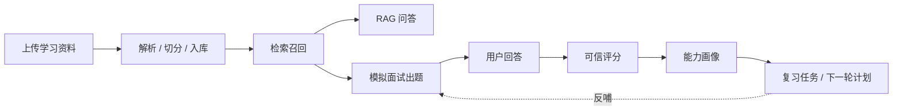
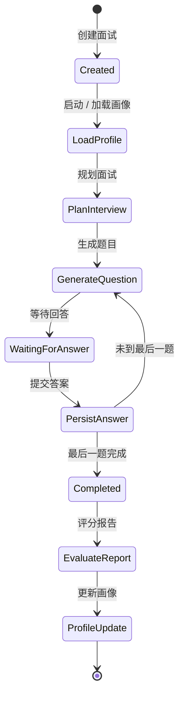

# AgentMentor 源码走读与面试讲解路线

> 定位：这不是逐行源码说明，而是面试前的“代码导航图”。目标是让你知道面试官问到某个能力时，应该从哪里开始讲、沿着哪些文件走、边界在哪里。

## 1. 先用 3 分钟讲清项目

### 1.1 一句话版本

AgentMentor 是一个面向 Java 后端转 AI Agent 开发的本地学习训练系统：用户上传学习资料形成知识库，系统基于 RAG 生成可溯源回答和模拟面试题，再通过可信评分沉淀能力画像、复习任务和下一轮训练计划。

### 1.2 面试版项目背景

我做这个项目的出发点不是单纯做一个聊天机器人，而是解决我自己转向 AI Agent 开发时遇到的一个问题：学习资料很多，但很难判断自己是否真的掌握，也很难持续追踪薄弱点。

所以我把系统设计成一个闭环：



面试中要强调：它的重点不是“把资料丢给大模型”，而是把学习过程工程化成可追踪、可评分、可复盘的训练闭环。

## 2. 推荐源码走读顺序

建议你不要从目录树第一行开始看，而是按业务链路走。

```text
前端操作
  ↓
FastAPI 路由
  ↓
Application Service
  ↓
Domain 规则 / RAG 能力 / LLM Gateway
  ↓
PostgreSQL + pgvector
  ↓
结果回到前端展示
```

## 3. 第一条主线：知识库入库

### 3.1 面试讲法

用户上传 Markdown、TXT、PDF、DOCX 后，系统会解析文档，按标题路径和长度进行切分，计算 embedding，最后写入 PostgreSQL/pgvector。这样后续 RAG 问答和面试出题都可以基于同一个知识库检索。

### 3.2 代码路线

```text
frontend/src/components/KnowledgePanel.jsx
  ↓ 调用上传接口
src/agent_mentor/api/knowledge.py
  ↓
src/agent_mentor/application/knowledge_service.py
  ↓
src/agent_mentor/rag/documents.py
src/agent_mentor/rag/chunking.py
  ↓
src/agent_mentor/infrastructure/embedding.py
  ↓
src/agent_mentor/infrastructure/database/models.py
```

### 3.3 你要掌握的点

- 文档解析不是企业级复杂文档治理，目前支持常见学习资料格式。
- 分块保留 heading path，有助于回答时展示来源上下文。
- 当前 embedding 默认是 development gateway，不是 BGE；BGE 已作为后续增强预留配置保护。
- 向量库用 PostgreSQL + pgvector，是为了控制本地 16GB 开发机部署成本。

### 3.4 面试官可能追问

如果问：“你这个文档清洗做到什么程度？”

建议答：

> 当前 V2 主要处理个人学习资料场景，做了格式解析、文本抽取、标题路径保留、分块和去重入库。复杂企业文档里的表格结构、图片 OCR、扫描件、权限继承、版本变更还没有完整展开，这部分我会作为企业化演进处理，而不是在个人项目里夸大实现范围。

## 4. 第二条主线：RAG 问答与知识边界

### 4.1 面试讲法

RAG 问答不是直接把问题交给 LLM，而是先做检索召回，再根据检索片段生成回答。系统会检查证据是否充分，并要求回答带引用；当证据不足时，系统应该显式降级，而不是让模型硬编。

### 4.2 代码路线

```text
frontend/src/components/RagPanel.jsx
  ↓
src/agent_mentor/api/chat.py
  ↓
src/agent_mentor/application/answer_service.py
  ↓
src/agent_mentor/infrastructure/retriever.py
src/agent_mentor/rag/retrieval.py
  ↓
src/agent_mentor/infrastructure/llm.py
src/agent_mentor/ports/llm_gateway.py
```

### 4.3 你要掌握的点

- `AnswerService` 是 RAG 回答主入口。
- `retriever.py` 负责实际从 PostgreSQL/pgvector 召回。
- `retrieval.py` 放检索融合、引用校验等偏算法/规则逻辑。
- `llm.py` 是 OpenAI-compatible Gateway，DeepSeek 通过配置接入。
- LLM 不可用时系统有确定性 fallback，保证演示链路可运行。

### 4.4 面试官可能追问

如果问：“怎么证明 RAG 质量在变好？”

建议答：

> V2 小优化里我补了 Retrieval Eval Runner，可以基于标注数据输出 Recall@1/3/6、MRR、证据充分率和不可回答拒答准确率。也就是说，后续切换 embedding、调整 chunk 或检索策略时，不是凭感觉判断，而是能用固定评测集做对比。

相关代码：

```text
evals/run.py
evals/metrics.py
evals/runners/retrieval_runner.py
tests/unit/test_eval_metrics.py
```

## 5. 第三条主线：模拟面试状态机

### 5.1 面试讲法

模拟面试不是一次性生成三道题，而是一个可恢复状态机。系统会创建面试、加载画像、规划题目、生成问题、等待用户回答、保存答案，然后判断是否进入下一题或结束。



### 5.2 代码路线

```text
frontend/src/components/InterviewPanel.jsx
  ↓
src/agent_mentor/api/interviews.py
  ↓
src/agent_mentor/application/interview_service.py
  ↓
src/agent_mentor/workflows/interview.py
src/agent_mentor/domain/interview.py
  ↓
src/agent_mentor/infrastructure/database/models.py
```

### 5.3 你要掌握的点

- `InterviewService` 负责创建面试、启动面试、生成题目、提交答案。
- `WorkflowCheckpointModel` 是状态轨迹证据，不要把它夸大成完整工作流引擎。
- `Idempotency-Key` 防止重复点击或网络重试造成同一题重复提交。
- 最近小优化补了数据库唯一约束冲突时的兜底返回，提升并发安全性。

### 5.4 面试官可能追问

如果问：“这算 Agent 吗？”

建议答：

> 我不会把它包装成完全自主 Agent。它更像一个受控的 Agentic Workflow：LLM 参与出题、参考答案、评分和解释，但关键状态流转、幂等、可信边界、画像更新都由应用层控制。这样比完全黑盒 Agent 更适合学习训练场景，也更容易验证和复盘。

## 6. 第四条主线：可信评分与报告

### 6.1 面试讲法

评分不能完全相信 LLM 的一句“总分”。系统通过 Rubric 维度评分、引用白名单、置信状态和应用层总分计算，让评分结果更可解释。前端报告展示总分，也展示逐题解析和扣分原因。

### 6.2 代码路线

```text
frontend/src/components/EvaluationPanel.jsx
frontend/src/components/ReportsPanel.jsx
  ↓
src/agent_mentor/api/evaluations.py
  ↓
src/agent_mentor/application/evaluation_service.py
  ↓
src/agent_mentor/domain/evaluation.py
src/agent_mentor/infrastructure/llm.py
```

### 6.3 你要掌握的点

- LLM 可以参与评分，但最终报告结构和总分由应用层规整。
- 低置信、争议或待复核结果不能直接污染画像。
- 每道题应解释为什么扣分、缺了什么、下一步怎么补。

### 6.4 面试官可能追问

如果问：“同一个模型出题又评分，会不会自说自话？”

建议答：

> 这是我设计里专门控制的风险。题目生成会带 Rubric，评分阶段不只看模型主观判断，还要求结合参考答案、Rubric、引用证据和置信状态。画像更新时也不会消费所有评分，低置信和争议状态要降权或不更新。后续企业化可以引入人工抽检和评测集校准。

## 7. 第五条主线：能力画像与复习闭环

### 7.1 面试讲法

能力画像不是简单把最近一次分数覆盖成百分比，而是把稳定主题作为主画像，把动态子知识点作为诊断证据。系统会根据可信评分渐进更新掌握度，并生成复习任务和下一轮训练计划。

### 7.2 代码路线

```text
frontend/src/components/ProfilePanel.jsx
frontend/src/components/PlanPanel.jsx
frontend/src/components/TrendPanel.jsx
  ↓
src/agent_mentor/api/profiles.py
  ↓
src/agent_mentor/application/profile_service.py
  ↓
src/agent_mentor/domain/profile.py
src/agent_mentor/domain/profile_taxonomy.py
  ↓
src/agent_mentor/infrastructure/database/models.py
```

### 7.3 你要掌握的点

- 画像跟知识库绑定，不同知识库应有不同画像。
- 高分不会立刻把画像拉满，因为系统使用渐进更新。
- 连续高分可以解决复习任务，避免“永远显示薄弱项”。
- 新文档导入后，会产生新的覆盖盲区，需要后续面试去查漏。

### 7.4 最近小优化：覆盖保底出题

这轮新增了“覆盖保底出题策略”：

```text
src/agent_mentor/application/interview_service.py
tests/unit/test_interview_service.py
```

核心逻辑：

- 如果当前知识库存在未覆盖知识点；
- 三题面试中第 2 题优先围绕这个知识点出题；
- 这样系统不只会“补低分”，也能主动“查漏”。

面试讲法：

> 原来画像更偏向补缺，即根据低分项推荐复习；但如果某些知识点从没被考到，系统其实不知道用户会不会。V2 后我加入覆盖保底策略，让面试流程周期性覆盖未考知识点，从而把“未知”变成“已验证”，这更接近真实学习闭环。

## 8. 第六条主线：前端工作台

### 8.1 面试讲法

前端不是单纯做几个按钮，而是把学习链路组织成一个工作台：知识库、RAG、面试、报告、画像、计划、历史趋势都在一个界面里串起来。后续我做过组件化拆分，降低单文件复杂度。

### 8.2 代码路线

```text
frontend/src/main.jsx
frontend/src/components/
frontend/src/styles.css
frontend/server.py
```

建议重点看这些组件：

```text
KnowledgePanel.jsx
KnowledgeBaseControls.jsx
RagPanel.jsx
InterviewPanel.jsx
EvaluationPanel.jsx
ProfilePanel.jsx
PlanPanel.jsx
ReportsPanel.jsx
TrendPanel.jsx
```

### 8.3 你要掌握的点

- 页面刷新后会尽量恢复当前知识库和状态。
- 新建知识库但未上传资料，不应该让用户丢失之前可用知识库。
- 前端显示的不只是结果，还承担演示系统闭环的职责。

## 9. 运行与部署边界

### 9.1 面试讲法

项目明确约束为“可在 16GB 普通开发机上通过 Docker Compose 部署”。这不是退而求其次，而是主动控制资源成本和系统复杂度。

### 9.2 代码路线

```text
docker-compose.yml
Dockerfile
frontend/server.py
src/agent_mentor/config.py
src/agent_mentor/api/health.py
```

### 9.3 你要掌握的点

- 三个核心容器：db、api、frontend。
- 数据库使用 PostgreSQL + pgvector。
- 大模型通过 OpenAI-compatible API 接入 DeepSeek。
- 无 Key 或失败时有 fallback，但面试演示最好配置真实 Key。
- BGE 暂不落地，避免引入模型下载、维度迁移和 16GB 资源压力。

## 10. 面试时最值得讲的 5 个亮点

### 10.1 RAG 不是装饰，而是出题和回答的共同底座

讲法：

> 检索结果既用于 RAG 问答，也用于面试题生成。这样面试不是凭模型自由发挥，而是围绕用户上传的学习资料展开。

对应代码：

```text
src/agent_mentor/application/answer_service.py
src/agent_mentor/application/interview_service.py
src/agent_mentor/infrastructure/retriever.py
```

### 10.2 评分结果不会直接污染画像

讲法：

> 画像只消费可信评分，低置信或争议结果会降权或不更新，避免一次异常评分破坏长期记忆。

对应代码：

```text
src/agent_mentor/application/profile_service.py
src/agent_mentor/domain/profile.py
src/agent_mentor/domain/evaluation.py
```

### 10.3 面试流程具备可恢复工作流特征

讲法：

> 每个关键节点都有 checkpoint，能够说明系统不是一次性脚本，而是有状态、有步骤、有恢复证据的工作流。

对应代码：

```text
src/agent_mentor/workflows/interview.py
src/agent_mentor/application/interview_service.py
src/agent_mentor/infrastructure/database/models.py
```

### 10.4 画像从“补缺”增强到“查漏”

讲法：

> 只看低分项会忽略未考知识点，所以我加入覆盖保底出题，让系统主动验证未知区域。

对应代码：

```text
src/agent_mentor/application/interview_service.py
src/agent_mentor/application/profile_service.py
```

### 10.5 引入 Eval Runner，开始具备质量度量能力

讲法：

> RAG 优化不能只靠主观感觉，所以我补了检索评估入口，用固定数据集观测 Recall、MRR 和证据充分率。

对应代码：

```text
evals/run.py
evals/metrics.py
evals/runners/retrieval_runner.py
```

## 11. 不建议夸大的边界

面试时不要说：

- “这是企业级 RAG 平台。”
- “实现了完整 LangGraph 工作流。”
- “复杂文档解析已经完全解决。”
- “BGE 已经接入并完成效果优化。”
- “画像就是完整长期记忆系统。”

建议说：

- “这是一个面向个人学习训练场景的 Agentic RAG 项目。”
- “当前重点是闭环设计、可信评分和画像驱动训练。”
- “企业级 RAG 的权限、复杂文档治理、多租户、评测平台是后续演进方向。”
- “BGE 已预留配置和维度保护，但当前为了本地资源和稳定演示暂不落地。”
- “画像可以理解为任务型长期记忆的一种简化实现。”

## 12. 面试前 90 分钟学习路线

如果时间有限，按这个顺序看：

1. 读本文第 1、2、10、11 节，先把项目说法定住。
2. 看 `src/agent_mentor/application/knowledge_service.py`，理解入库。
3. 看 `src/agent_mentor/application/answer_service.py`，理解 RAG。
4. 看 `src/agent_mentor/application/interview_service.py`，理解面试状态机和覆盖保底出题。
5. 看 `src/agent_mentor/application/evaluation_service.py`，理解评分。
6. 看 `src/agent_mentor/application/profile_service.py`，理解画像更新。
7. 打开前端跑一次完整演示。

最后你需要能自然讲出这句话：

> 这个项目不是为了证明我调了几个大模型接口，而是把 RAG、LLM 评分、可恢复工作流、能力画像和复习计划串成一个能长期迭代的学习训练闭环。它目前不是企业级平台，但已经覆盖了企业级 RAG/Agent 系统里很关键的工程问题：知识边界、状态一致性、结果可信、可观测和质量评估。
