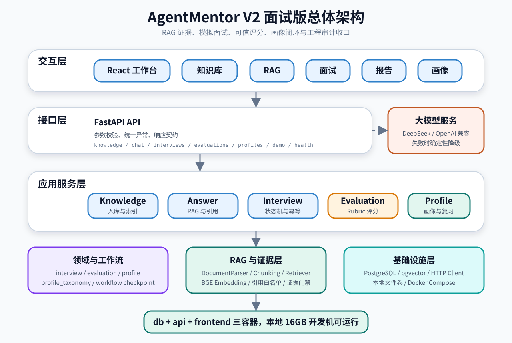
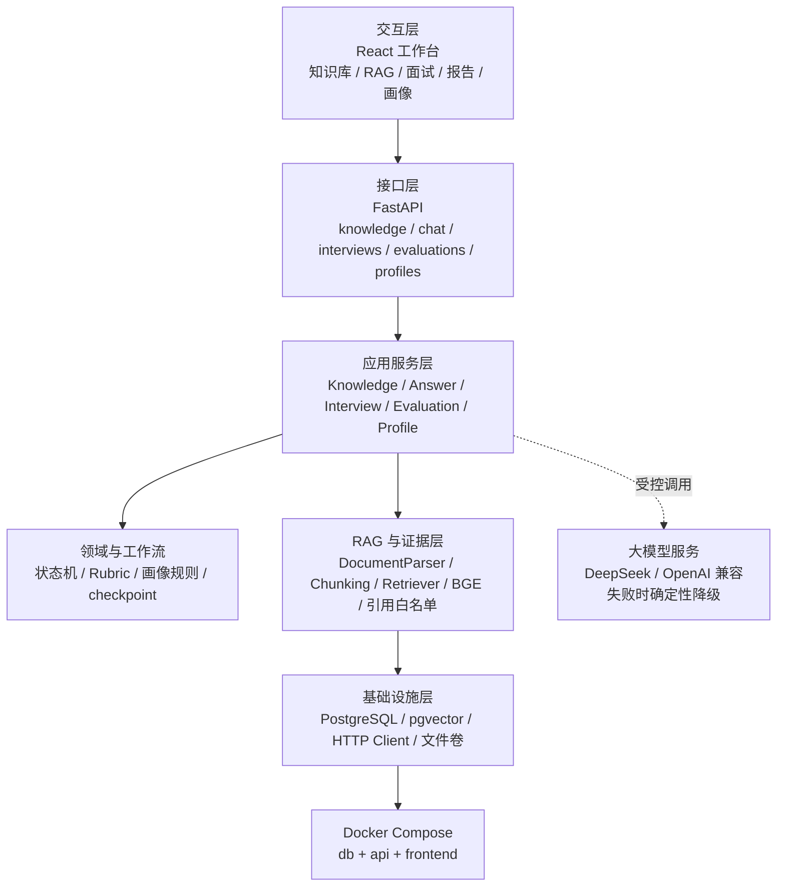
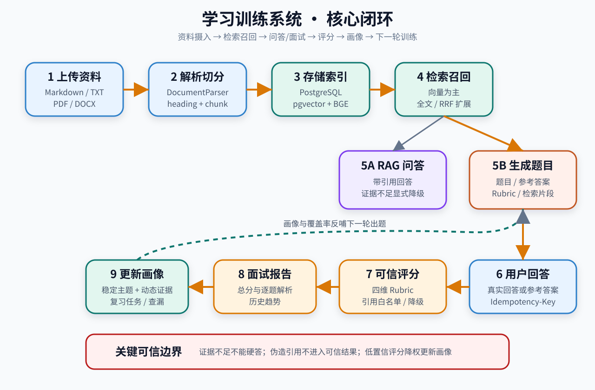
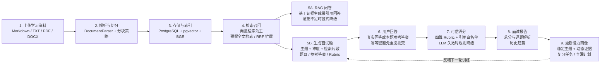
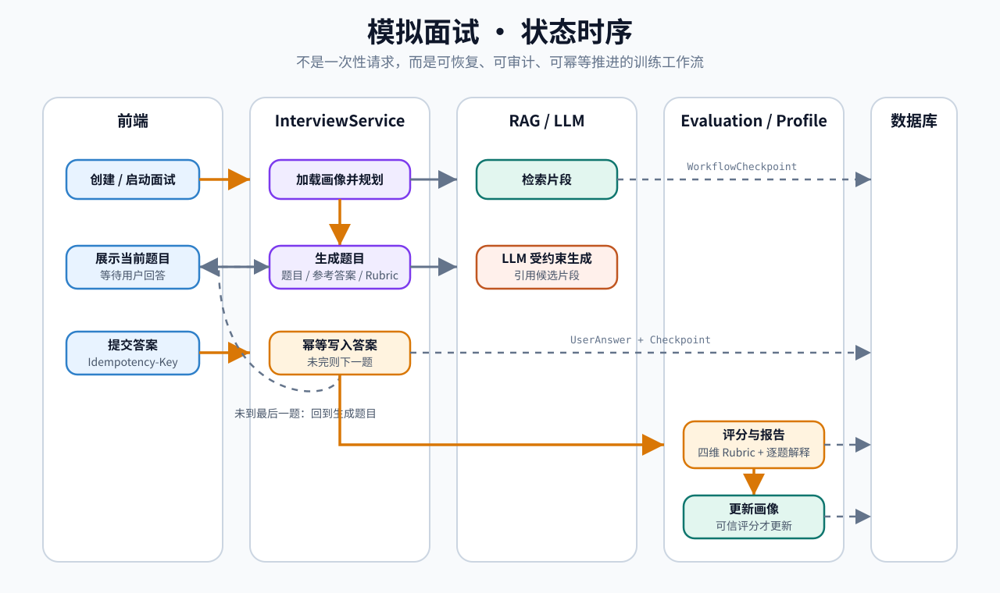
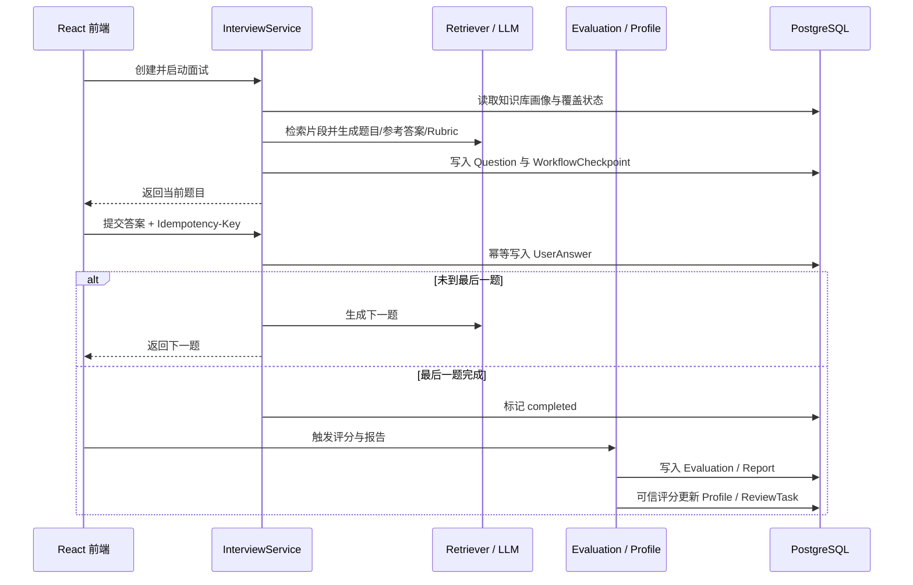

# AgentMentor 简历与面试表达总纲

> 使用场景：简历项目描述、3 分钟项目讲解、面试官追问训练。  
> 学习目标：不逐行背源码，但能讲清楚项目价值、核心链路、关键取舍和真实边界。  
> 当前口径：AgentMentor V2，本地单用户学习训练系统，核心卖点是 RAG 证据 + 模拟面试 + 可信评分 + 能力画像闭环。

---

## 0. 你要先建立的心智模型

这个项目不要讲成“我做了一个 RAG 聊天机器人”，那样会显得太普通。

更好的讲法是：

> 我做的是一个面向个人学习者的 AI 面试训练系统。它不是只回答问题，而是把学习资料转成可引用知识库，再基于知识库生成面试题、评分、报告和长期能力画像，最后用画像和知识覆盖状态反哺下一轮训练。

面试时要围绕三条线讲：

```text
资料可信：资料解析 → 分块 → BGE 向量 → pgvector 检索 → 引用白名单
训练闭环：出题 → 答题 → Rubric 评分 → 报告 → 画像 → 复习任务
工程可靠：分层架构 → 状态机 → 幂等 → checkpoint → 降级 → 自动化审计
```

---

## 1. 简历项目描述，控制在 6～8 行

### 1.1 简历项目描述

AgentMentor 是一个面向个人学习者的 AI 面试训练系统，支持将 Markdown、TXT、PDF、DOCX 学习资料构建为可引用知识库，并围绕资料进行 RAG 问答、模拟面试、可信评分和长期能力画像更新。  
后端基于 FastAPI、PostgreSQL、pgvector、SQLAlchemy 和 Alembic 实现模块化单体架构，使用 BGE Embedding 完成本地语义向量化，并通过 OpenAI-compatible 网关接入 DeepSeek。  
系统将检索片段同时用于 RAG 回答和面试题生成，回答阶段通过证据门禁和引用白名单限制幻觉，证据不足时显式降级。  
模拟面试采用可恢复状态机设计，支持 checkpoint、答题幂等、逐题评分、报告历史和多轮趋势展示。  
评分结果基于四维 Rubric 生成，应用层重新计算最终分，并只将可信评分写入知识库隔离的两层能力画像。  
画像模型区分稳定主题、动态诊断子知识点和知识覆盖状态，用于生成复习任务、专项训练和下一轮查漏计划。  
工程上补充了 API 契约、状态一致性、RAG 引用可信度、评分区分度和检索质量 Eval，形成从功能闭环到可验证工程闭环的完整收口。  
项目通过 Docker Compose 编排 db、api、frontend 三容器，约束在本地 16GB 开发机可运行，适合作为 AI 应用工程化与 RAG 可信性的面试项目。

### 1.2 简历 bullet 版本

- 设计并实现基于 FastAPI + PostgreSQL/pgvector + React 的 AI 面试训练系统，支持资料入库、RAG 问答、模拟面试、评分报告、能力画像与复习计划闭环。
- 接入 BGE 本地 Embedding 与 DeepSeek/OpenAI-compatible LLM 网关，通过证据门禁、引用白名单、确定性降级和 Eval 测试提升 RAG 回答可信度。
- 实现可恢复面试状态机、答题幂等、报告历史、知识库隔离画像和覆盖率驱动出题，并补充 API 契约、数据一致性、RAG 边界等自动化审计测试。

### 1.3 不建议出现在简历里的表述

不要写：

- “企业级 RAG 平台”；
- “完全自动化面试官 Agent”；
- “生产级多租户系统”；
- “完全解决大模型幻觉”；
- “支持所有复杂文档解析”。

可以写：

- “面向个人学习训练场景”；
- “具备企业级 RAG 问题意识”；
- “实现本地可运行的可信闭环原型”；
- “对复杂文档、多租户、异步任务等保留演进方案”。

---

## 2. 整体框架图：你要会 60 秒讲清楚



### 2.1 图解说明

这张图回答的是：项目整体怎么分层，每层负责什么，为什么不是把所有逻辑塞在一个接口里。

读图顺序：

1. 最上层是 React 工作台，负责用户操作和状态展示；
2. 请求进入 FastAPI 接口层，接口层只做参数校验、异常转换和响应契约；
3. 核心业务由 Application Service 编排，包括资料、RAG、面试、评分和画像；
4. 领域层沉淀状态机、评分规则、画像规则和知识覆盖规则；
5. RAG 层处理解析、切分、检索、引用校验和 Embedding；
6. 基础设施层连接 PostgreSQL、pgvector、HTTP Client 和本地文件卷；
7. 外部 LLM 只作为能力提供方，不能直接决定业务状态。

### 2.2 代码路线

| 层 | 你需要知道的代码 |
| --- | --- |
| 前端工作台 | `frontend/src/main.jsx`、`frontend/src/components/` |
| API 层 | `src/agent_mentor/api/knowledge.py`、`chat.py`、`interviews.py`、`evaluations.py`、`profiles.py` |
| 应用服务层 | `src/agent_mentor/application/knowledge_service.py`、`answer_service.py`、`interview_service.py`、`evaluation_service.py`、`profile_service.py` |
| 领域规则 | `src/agent_mentor/domain/interview.py`、`evaluation.py`、`profile.py`、`profile_taxonomy.py` |
| RAG 能力 | `src/agent_mentor/rag/documents.py`、`chunking.py`、`retrieval.py` |
| 基础设施 | `src/agent_mentor/infrastructure/retriever.py`、`bge_embedding.py`、`llm.py`、`database/models.py` |

### 2.3 Mermaid 源码



### 2.4 面试时一句话总结

> 我采用的是模块化单体分层架构。Router 不写业务规则，Service 负责编排用例，Domain 放状态和规则，Infrastructure 隔离数据库、检索、Embedding 和 LLM。这样既适合个人项目本地运行，也方便面试时讲清楚每个模块为什么存在。

---

## 3. 核心闭环流程图：你要会讲“项目不是普通 RAG”



### 3.1 图解说明

这张图回答的是：学习资料怎么变成长期训练闭环。

核心流程：

1. 用户上传学习资料；
2. 系统解析、切分、去重并向量化；
3. chunk 写入 PostgreSQL/pgvector；
4. 检索召回同时服务 RAG 问答和面试出题；
5. RAG 回答必须基于证据生成引用，证据不足时降级；
6. 面试题生成会产出题目、参考答案和 Rubric；
7. 用户提交答案后进入四维评分；
8. 评分报告展示总分、逐题解析和趋势；
9. 可信评分更新能力画像、错误模式、复习任务和覆盖状态；
10. 画像和覆盖率反哺下一轮训练。

### 3.2 代码路线

| 流程节点 | 代码入口 |
| --- | --- |
| 上传资料 | `src/agent_mentor/api/knowledge.py` |
| 解析与切分 | `src/agent_mentor/rag/documents.py`、`src/agent_mentor/rag/chunking.py` |
| 向量化 | `src/agent_mentor/infrastructure/bge_embedding.py` |
| 检索召回 | `src/agent_mentor/infrastructure/retriever.py` |
| 证据判断 | `src/agent_mentor/application/answer_service.py` |
| 出题 | `src/agent_mentor/application/interview_service.py` |
| 评分 | `src/agent_mentor/application/evaluation_service.py` |
| 画像更新 | `src/agent_mentor/application/profile_service.py` |
| 覆盖率与查漏 | `src/agent_mentor/application/coverage_catalog.py` |

### 3.3 关键代码片段

面试中不需要背完整代码，只要记住这类判断存在即可。

```python
# src/agent_mentor/application/answer_service.py
def assess_evidence(
    self, question: str, candidates: list[RetrievedChunk]
) -> tuple[list[RetrievedChunk], bool]:
    supported_candidates = self._supported_candidates(question, candidates)
    sufficient = (
        bool(supported_candidates)
        and supported_candidates[0].score >= self._min_evidence_score
    )
    return supported_candidates, sufficient
```

这段代码体现的是：不是检索分高就一定能回答，还要先判断候选片段是否真的支持问题。

```python
# src/agent_mentor/application/answer_service.py
def ensure_citations_are_valid(
    citation_ids: list[UUID], context: list[RetrievedChunk]
) -> None:
    try:
        validate_citations(citation_ids, context)
    except ValueError as error:
        raise AppError(
            "LLM_OUTPUT_INVALID",
            "Citation validation failed.",
            detail=str(error),
        ) from error
```

这段代码体现的是：LLM 不能随便编造引用，引用必须来自本次检索上下文。

### 3.4 Mermaid 源码



---

## 4. 面试状态时序图：你要会讲“可恢复工作流”



### 4.1 图解说明

这张图回答的是：为什么模拟面试不是简单循环调用 LLM。

项目里的面试流程更接近一个可恢复状态机：

1. 前端创建并启动面试；
2. `InterviewService` 加载当前知识库下的画像和覆盖状态；
3. 服务规划本轮面试主题与难度；
4. 每一道题都基于检索片段生成题目、参考答案和 Rubric；
5. 用户提交答案时带 `Idempotency-Key`；
6. 系统幂等写入答案，避免重复点击或网络重试导致重复提交；
7. 未到最后一题则生成下一题；
8. 最后一题完成后生成评分和报告；
9. 可信评分更新画像和复习任务；
10. 关键节点写入 checkpoint，支持状态恢复和面试讲解。

### 4.2 代码路线

| 关注点 | 代码位置 |
| --- | --- |
| 创建/启动面试 | `src/agent_mentor/api/interviews.py` |
| 面试状态枚举 | `src/agent_mentor/domain/interview.py` |
| 面试编排 | `src/agent_mentor/application/interview_service.py` |
| checkpoint 记录 | `src/agent_mentor/workflows/interview.py`、`src/agent_mentor/infrastructure/database/models.py` |
| 幂等约束 | `UserAnswerModel`、`tests/unit/test_data_consistency_constraints.py` |
| 报告生成 | `src/agent_mentor/application/evaluation_service.py` |
| 画像更新 | `src/agent_mentor/application/profile_service.py` |

### 4.3 Mermaid 源码



### 4.4 面试时一句话总结

> 这部分我会重点讲成工作流工程化，而不是简单问三道题。每题都有状态推进、幂等提交和 checkpoint，最后评分结果还会影响画像和复习任务，所以它是一个可恢复、可审计的训练闭环。

---

## 5. 面试 3 分钟讲解稿

### 5.1 30 秒：项目背景

我做 AgentMentor 的背景是自己从 Java 后端转向 AI Agent 方向时，发现单纯把资料丢给大模型模拟面试有两个问题：第一，模型回答和出题是否基于资料不透明；第二，每次对话结束后，学习者没有长期能力画像，也不知道下一轮该补什么。

所以我想做一个不是“一次性聊天”的系统，而是把资料、问答、面试、评分、画像和复习任务串成闭环。

### 5.2 60 秒：核心链路

用户先上传 Markdown、TXT、PDF 或 DOCX，后端会解析、切分、去重、向量化，并写入 PostgreSQL/pgvector。RAG 问答和面试出题都依赖这套检索能力。

RAG 问答时，系统会先召回候选片段，再判断证据是否足够。如果证据不足，就显式降级，不硬答。LLM 返回引用时，还必须通过引用白名单校验，不能编造 chunk_id。

模拟面试时，系统根据知识库、画像、覆盖状态和难度生成题目，同时生成参考答案和 Rubric。用户回答后，系统按正确性、完整性、推理、表达四个维度评分，生成逐题解析和报告。

### 5.3 60 秒：技术亮点

我认为项目有三个重点。

第一是 RAG 可信性。我没有只做向量检索，而是补了证据门禁、引用白名单和证据不足降级，避免模型看起来回答了但其实没有依据。

第二是训练闭环。画像不是简单显示分数，而是按知识库隔离，并采用“稳定主题 + 动态诊断子知识点 + 覆盖状态”的两层模型。这样可以区分“这个点回答错了”和“这个点还没被考到”。

第三是工程可靠性。面试流程做了状态机、checkpoint 和答题幂等，评分和画像更新也有一致性约束。后期我还补了 API 契约、状态一致性、RAG 引用可信度、评分区分度等自动化审计测试。

### 5.4 30 秒：真实边界

这个项目我不会把它包装成企业级 RAG 平台。它当前定位是本地单用户学习训练系统。复杂文档解析、多租户权限、异步任务队列、线上 A/B 和大规模人工标注集还不是当前版本范围。但它已经体现了我对 AI 应用工程化、RAG 可信性和长期训练闭环的完整思考。

---

## 6. 高频面试追问 Q&A：面试官与面试者 loop

下面的 Q&A 不是“开天眼式源码拷问”，而是真实面试官可能根据你的回答继续追问的链路。每一组都包含：

```text
面试官提问 → 面试者回答 → 面试官基于回答继续追问 → 面试者补充
```

### Q1：你这个项目和普通 RAG 聊天机器人有什么区别？

面试官：

> 你说这是 AI 面试训练系统，那它和普通的 RAG ChatBot 区别在哪里？

面试者：

> 普通 RAG ChatBot 的核心是“用户问、系统答”，一般到回答结束就结束了。AgentMentor 的重点是把 RAG 作为训练系统的底座。资料入库后不只用于问答，还用于生成面试题、参考答案和 Rubric。用户回答后会产生评分报告，可信评分会更新能力画像、错误模式、复习任务和覆盖状态，最后反哺下一轮出题。所以它不是一次性问答，而是学习训练闭环。

面试官追问 1：

> 那你这个闭环里，画像是怎么发挥作用的？

面试者回答：

> 画像主要做两件事：补缺和查漏。补缺是根据最近评分和错误模式找出薄弱主题；查漏是根据知识库中哪些知识点还没有被题目覆盖，安排后续出题。这样避免用户一直刷熟悉的点，也避免把“没考到”误判成“掌握得好”。

面试官追问 2：

> 如果一轮面试高分，画像会不会马上变得很高？

面试者回答：

> 不会直接跳很高。画像采用渐进更新，因为单轮高分可能来自题目较简单、参考答案辅助或者评分波动。系统更关注多轮趋势和可信评分，连续高分才会逐步提升掌握度，并可能关闭对应复习任务。

本题考察点：

> 能不能把项目从“聊天机器人”拔高到“训练闭环系统”。

---

### Q2：你的 RAG 如何避免模型幻觉？

面试官：

> RAG 项目经常会被问到幻觉问题。你这里怎么控制？

面试者：

> 我做了两层控制。第一层是证据门禁：检索候选不只是看分数，还要判断候选内容和问题是否有实际支持关系。第二层是引用白名单：LLM 只能引用本次检索返回的 chunk_id，如果返回了不存在的引用，就认为输出不可信，降级为确定性回答并记录日志。

面试官追问 1：

> 如果检索分很高但内容不相关怎么办？

面试者回答：

> 项目里有 `assess_evidence` 逻辑，会先过滤真正有词面支持的候选，再判断证据是否充足。后面我还专门补了测试：一个无关 chunk 即使分数很高，也不能把 evidence_sufficient 判成 true。

面试官追问 2：

> 如果资料确实不足，系统会怎么回答？

面试者回答：

> 如果不允许模型补充，就返回证据不足提示，告诉用户需要补充资料或调整问题。如果允许模型补充，也要明确标注“模型补充”，不能伪装成知识库引用结论。

面试官追问 3：

> 你怎么证明这些不是口头设计？

面试者回答：

> 我补了 RAG 引用可信度测试，包括引用白名单校验、跨领域问题拒答、无关高分候选过滤、LLM 伪造引用降级等。最终工程审计里也把这部分作为 P1 验收项。

进一步的离线实验中，我还把回答拆成 DraftClaim，对确定性规则、NLI 和类型化语义去重做了
消融。候选在 Development 上达到满分，但独立 holdout 的 recall 只有 66.67%，没有达到
预声明门槛，所以最终没有接入生产。这说明项目的可信性不只来自“做了门禁”，也来自数据
隔离、一次性 holdout 和失败后拒绝上线的工程决策。

本题考察点：

> 能不能讲清楚“RAG 可信”不是靠 prompt，而是靠工程门禁和测试。

---

### Q3：为什么选择 PostgreSQL + pgvector，而不是单独向量数据库？

面试官：

> 你为什么用 PostgreSQL/pgvector？为什么不用 Milvus、ES 或专门向量库？

面试者：

> 这个项目的目标是本地单用户学习训练系统，不是大规模企业检索平台。PostgreSQL 可以同时承载业务事务、全文检索和向量检索，配合 pgvector 能降低部署复杂度。对 16GB 本地开发机来说，db、api、frontend 三容器更容易跑通和演示。

面试官追问 1：

> 那如果数据量上来怎么办？

面试者回答：

> 可以分阶段演进。第一阶段仍然优化 pgvector 索引、chunk 策略和召回参数；第二阶段引入专门全文检索，比如 Elasticsearch 或 OpenSearch；第三阶段再拆向量检索服务或引入 Milvus。当前版本保留了 Retriever Port，所以检索实现是可替换的。

面试官追问 2：

> 当前方案的局限是什么？

面试者回答：

> 局限是复杂过滤、大规模召回、多租户隔离、线上索引更新和检索评估能力不如专门检索系统。但对当前个人训练场景，PostgreSQL/pgvector 的收益是工程复杂度低、事务一致性好、部署可控。

本题考察点：

> 技术选型是否匹配场景，而不是盲目堆热门组件。

---

### Q4：BGE Embedding 改造带来了什么价值？

面试官：

> 你之前用什么做向量？后来为什么改 BGE？

面试者：

> 早期为了快速跑通流程，用的是 development embedding，也就是特征哈希类的轻量向量，优点是无模型依赖，缺点是语义能力弱。后面我改成 BGE 本地 Embedding，目标是提升中文技术文档的语义召回质量，让 RAG 和面试出题更贴近资料内容。

面试官追问 1：

> 为什么不用云端 embedding？

面试者回答：

> 主要是本地演示和成本控制。BGE small 体积相对可控，适合本地 Docker 环境。云端 embedding 当然也可以接，但需要考虑成本、网络、隐私和稳定性。项目通过 EmbeddingGateway 隔离实现，后续可以替换。

面试官追问 2：

> 改 BGE 后有没有验证？

面试者回答：

> 做了检索评估和多轮模拟面试验证，关注 Recall@K、证据充分率、负样本拒答能力，以及题目是否更贴合资料。这个项目里的改造不是只换模型名，而是围绕检索质量做回归。

本题考察点：

> 能不能说明模型替换背后的工程收益和验证方式。

---

### Q5：你的模拟面试为什么要做状态机？

面试官：

> 三道题面试听起来可以直接循环调用 LLM，为什么还要状态机和 checkpoint？

面试者：

> 因为真实交互不是一次性完成的。用户可能刷新页面、重复点击、网络重试、回答一半中断。状态机可以明确当前处于 created、waiting_for_answer、completed 等状态，checkpoint 可以记录关键节点，幂等键可以避免重复提交同一道题。

面试官追问 1：

> 如果用户重复提交答案怎么办？

面试者回答：

> 前端会带 `Idempotency-Key`，后端应用层和数据库唯一约束共同兜底。同一个 question_id 和 idempotency_key 只能写入一次，重复提交时返回已有结果，不会污染评分和画像。

面试官追问 2：

> 这个设计能体现 Agent 工程化吗？

面试者回答：

> 能体现一部分。虽然当前不是完整 LangGraph Runtime，但它体现了 Agent 工作流里很关键的能力：状态可恢复、节点可审计、副作用可控、失败可降级。这些比简单 prompt 调用更接近工程化 Agent。

本题考察点：

> 能不能把状态机讲成“可靠交互”而不是过度设计。

---

### Q6：评分系统如何保证可信？

面试官：

> LLM 打分会不会很主观？你怎么保证评分可信？

面试者：

> 我没有让 LLM 只输出一个总分，而是让它按 Rubric 结构化输出，包括正确性、完整性、推理、表达四个维度。最终分不是直接相信模型，而是在应用层根据维度分重新计算。同时评分会带置信状态，低置信或异常输出不会直接污染画像。

面试官追问 1：

> 为什么要应用层重新计算总分？

面试者回答：

> 因为总分属于业务规则，不应该完全交给模型。模型可以给维度判断和解释，但最终聚合应该由确定性代码完成，这样前后端展示、报告历史和画像更新才能一致。

面试官追问 2：

> 有没有验证评分区分度？

面试者回答：

> 有做人工答案集和评分区分度 Eval。思路是给同一批题目准备不同质量答案，观察模型评分是否能区分高、中、低质量回答，并统计 MAE、相关性和复核命中率。这样可以避免系统“所有答案都差不多分”。

本题考察点：

> 能不能说明 LLM 评分如何被工程约束。

---

### Q7：能力画像是不是 Memory？

面试官：

> 你这个个人画像能不能理解为 Memory？

面试者：

> 可以理解为一种简化且结构化的长期 Memory，但它不是聊天历史记忆。它记的不是用户说过什么，而是用户在某个知识库下的能力状态：稳定主题掌握度、动态子知识点诊断、错误模式、复习任务和覆盖状态。

面试官追问 1：

> 为什么画像要跟知识库绑定？

面试者回答：

> 因为不同知识库代表不同学习领域。用户在 Java 集合上的掌握度不能影响 Agent RAG 的画像。如果画像不按 knowledge_base_id 隔离，切换资料后推荐和评分都会污染。

面试官追问 2：

> 为什么要分稳定主题和动态子知识点？

面试者回答：

> 稳定主题适合长期统计，比如“RAG 检索增强生成”“评估与可靠性”；动态子知识点适合作为诊断证据，比如某次具体错在“引用白名单”或“上下文窗口管理”。这样既不会让画像节点无限膨胀，也能保留具体问题。

面试官追问 3：

> 高分后复习任务如何处理？

面试者回答：

> 连续高分会提高对应主题掌握度，并逐步解决或关闭复习任务，而不是一次高分立刻清空。这样可以避免评分波动导致画像剧烈变化。

本题考察点：

> 能不能把画像讲成结构化长期记忆，而不是页面上的几个分数。

---

### Q8：如果上传新文档，系统如何避免只考旧内容？

面试官：

> 用户给同一个知识库继续上传新文档，系统怎么知道哪些内容还没考过？

面试者：

> 项目里引入了知识覆盖状态。资料入库后会形成知识目录或覆盖点，题目生成时会记录题目实际覆盖了哪些知识点。画像负责“答得怎么样”，覆盖状态负责“有没有考到”。下一轮出题时可以优先覆盖未考过或覆盖不足的点。

面试官追问 1：

> 为什么不直接用低分代表没掌握？

面试者回答：

> 因为“没考到”和“考了但答错”是两种不同问题。没考到应该查漏，答错才是补缺。如果混在一起，系统会误以为用户掌握了没被问过的内容。

面试官追问 2：

> 当前覆盖率是否非常精确？

面试者回答：

> 当前是面向个人训练场景的工程实现，不是企业知识图谱级别的精确标注。它通过题目引用、目录点和评分记录建立可解释覆盖证据，后续可以引入更细粒度实体抽取或人工确认。

本题考察点：

> 是否理解“训练质量可信”不只是评分，还包括覆盖率。

---

### Q9：前端在这个项目里只是展示页面吗？

面试官：

> 这个项目看起来后端比较重，前端只是展示吗？

面试者：

> 前端不只是展示，它承担了训练工作台的状态组织。比如知识库选择、上传状态、RAG 问答、面试流程、逐题解析折叠、画像和报告历史都在前端串起来。后面还优化过刷新恢复，避免用户刷新后丢失当前知识库。

面试官追问 1：

> 为什么刷新恢复重要？

面试者回答：

> 因为这是学习工具，用户可能边看文档边刷新或重启。如果刷新后显示“没有知识库”或“本地降级”，会让人以为系统没跑通。前端要主动恢复最近有资料的知识库和本机用户画像。

面试官追问 2：

> 你做过哪些前端工程化调整？

面试者回答：

> 做过组件化拆分、页面布局重构、评分解释折叠、状态卡片整理和生产构建回归。目标是让演示路径清晰，不让所有模块挤在一个长页面里。

本题考察点：

> 前端是否围绕用户流程设计，而不是“能显示就行”。

---

### Q10：你如何做工程审计和回归？

面试官：

> 你提到做了很多审计，具体审计了什么？

面试者：

> 我把审计分成几类：API 契约与异常路径、数据一致性与状态机、RAG 引用可信度、检索质量 Eval、评分区分度 Eval、前端构建回归。最后一轮还专门沉淀了工程审计收口文档。

面试官追问 1：

> API 契约审计有什么价值？

面试者回答：

> 它保证异常返回稳定，比如参数错误、缺少幂等键、应用错误都能返回统一结构。这样前端可以稳定处理错误，不会一会儿读 `detail`，一会儿读字符串或 500。

面试官追问 2：

> 状态一致性审计有什么价值？

面试者回答：

> 它保证核心副作用不重复，比如同一道题同一个幂等键只能提交一次，同一个回答只能评分一次，同一场面试只能有一份报告，同一个 evaluation 只应用一次画像更新。

面试官追问 3：

> RAG 审计有什么价值？

面试者回答：

> 它验证系统不会把伪造引用当成可信答案，也不会因为无关 chunk 检索分高就判断证据充足。这是 RAG 项目里很关键的可信边界。

本题考察点：

> 项目是否有从“开发完成”到“质量收口”的过程意识。

---

### Q11：这个项目离企业级 RAG 还差什么？

面试官：

> 如果把它扩展成企业级 RAG 系统，还差哪些关键能力？

面试者：

> 主要差五类能力。第一是复杂文档解析，比如表格、图片、扫描件、跨页结构；第二是权限和多租户，检索必须遵守用户权限；第三是异步任务和索引治理，大文档不能同步阻塞上传接口；第四是大规模检索评估和线上观测；第五是数据安全、审计和模型输出合规。

面试官追问 1：

> 复杂文档你会怎么做？

面试者回答：

> 会引入版面解析、OCR、表格结构化和元数据保留。chunk 不只存纯文本，还要存页码、标题层级、表格行列、图片说明、来源权限和解析置信度。检索时根据问题类型选择文本、表格或图片说明等不同索引。

面试官追问 2：

> 权限怎么控制？

面试者回答：

> 不能只在回答后过滤，而要在检索前或检索时就做权限过滤。chunk 级别带 ACL 或租户字段，Retriever 查询必须带用户上下文，避免模型看到无权限资料。

面试官追问 3：

> 你当前项目为什么没做？

面试者回答：

> 因为当前目标是个人学习训练，不是企业知识库系统。我保留了分层和 Port，使这些能力后续可以扩展，但没有为了简历过度堆复杂组件。

本题考察点：

> 能不能诚实讲边界，同时给出合理企业级演进路径。

---

### Q12：如果让你继续做 V3，你会做什么？

面试官：

> 你后续最想优化哪部分？

面试者：

> 我会优先继续做面试官 Agent 化和训练质量评估。当前工程已经补了轻量面试官策略层，题目生成会记录为什么选择覆盖盲区、历史题冷却或计划题；但它仍是受控策略，不是完整自主追问 Agent Loop。V3 可以进一步让面试官根据用户上一题回答决定追问、换题、复盘或结束，同时保留确定性状态机做边界控制。

面试官追问 1：

> 为什么不是先做更多功能？

面试者回答：

> 因为继续堆功能不一定提升项目质量。当前最有价值的是让训练更像真实面试：问题要能追问，评分要有区分度，画像要能指导下一步。也就是从“流程可信”继续推进到“训练质量可信”。

面试官追问 2：

> V3 最大风险是什么？

面试者回答：

> 最大风险是让 LLM 直接控制业务状态，导致不可预测。所以我会把 LLM 作为策略建议方，最终状态迁移、幂等、副作用和画像更新仍由确定性代码控制。

本题考察点：

> 能不能体现 Agent 思维，但不把系统交给模型裸奔。

---

## 7. 最后一轮小型包装与工程表达增强

这轮不是新版本，也不是大改架构，而是为了让项目在面试中更容易被看懂、追问时更站得住。

### 7.1 做了什么

| 目标 | 最小改造 | 面试价值 |
| --- | --- | --- |
| 前端演示模式 | 首页增加演示路线、可信证据和企业级边界展示 | 面试官打开页面后能快速理解“怎么演示” |
| InterviewPolicy 策略层 | 在出题时记录策略动作、原因、目标主题和确定性边界 | 体现 Agent 工程化意识，但不让 LLM 接管状态 |
| Readiness / 企业级边界 | `/api/v1/demo/readiness` 增加 signals 和 enterprise_boundaries | 能诚实说明已具备能力和未实现边界 |

### 7.2 代码路线

```text
frontend/src/components/AppLayout.jsx
  → OverviewDashboard 增加 INTERVIEW DEMO MODE

frontend/src/components/RuntimeInsights.jsx
  → 系统状态页展示 readiness signals 和企业级边界

src/agent_mentor/application/interview_service.py
  → InterviewPolicyDecision
  → _question_policy()
  → 结果写入 question.rubric.interview_policy

src/agent_mentor/application/demo_readiness_service.py
  → ReadinessSignal
  → enterprise_boundaries

src/agent_mentor/api/demo.py
  → readiness response 扩展 signals / enterprise_boundaries
```

### 7.3 面试表达

> 最后一轮我没有继续堆功能，而是做了工程表达增强。前端补了演示模式，后端补了轻量面试官策略和 readiness 企业级边界。这样项目仍保持 V2 的稳定主链路，但在 Agent 工程化、产品演示和落地边界表达上更完整。

---

## 8. 你最终要背下来的 5 句“定海神针”

1. 这个项目不是普通 RAG ChatBot，而是 RAG 驱动的学习训练闭环。
2. LLM 只提供生成和判断能力，最终业务状态由确定性代码控制。
3. RAG 可信性靠证据门禁、引用白名单、拒答降级和测试回归，不只靠 prompt。
4. 画像是按知识库隔离的结构化长期 Memory，区分补缺、查漏和复习任务。
5. 当前不是企业级 RAG 平台，但已经具备企业级问题意识和可演进的分层边界。

---

## 9. 一分钟压缩版

如果面试官只给你一分钟，就这样讲：

> AgentMentor 是我做的一个 AI 面试训练系统，目标是解决普通大模型面试“不可溯源、无长期画像”的问题。系统支持上传学习资料，解析切分后用 BGE 和 pgvector 建知识库；RAG 问答和面试出题都基于检索片段，回答阶段有证据门禁和引用白名单，证据不足会显式降级。面试流程用状态机和 checkpoint 管理，提交答案有幂等控制。评分不是只让模型给总分，而是四维 Rubric 结构化评分，再由应用层计算报告，并只把可信评分更新到按知识库隔离的两层能力画像。后续画像和覆盖状态会反哺下一轮训练。工程上我还做了 API 契约、状态一致性、RAG 可信边界、检索质量和评分区分度等回归测试，所以它不只是一个 demo，而是一个本地可运行、可解释、可审计的 AI 应用闭环。
