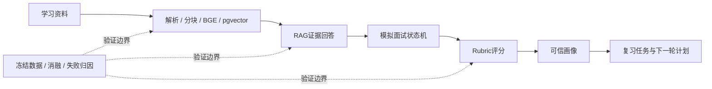

# AgentMentor 终局面试展示包

> 用途：8 分钟现场演示、3 分钟项目介绍、15 分钟技术追问。  
> 当前策略：产品与算法改造已经收口；本包只展示已经验证的主链路和真实实验结论。

## 1. 面试官应该看到什么

不要把项目讲成“接了大模型的聊天页面”。应让面试官看到三件事：

1. 它是一个有状态的学习训练闭环，而不是一次性问答；
2. 它用证据、规则和评测约束模型，而不是把业务事实交给模型；
3. 它能用实验拒绝不可靠候选，而不把局部指标包装成生产能力。



## 2. 8分钟演示顺序

| 时间 | 操作 | 要讲的重点 |
| --- | --- | --- |
| 0:00–0:40 | 首页与运行状态 | FastAPI、PostgreSQL/pgvector、React 的模块化单体；LLM 不是业务状态的唯一事实来源。 |
| 0:40–1:40 | 知识库与一条RAG问题 | 回答必须建立在检索证据与引用白名单上；证据不足会降级。 |
| 1:40–3:30 | 发起三题模拟面试并提交一题 | 工作流有 checkpoint、可恢复状态和幂等提交，不是一次性 prompt。 |
| 3:30–4:50 | 评分报告 | Rubric 结构化评分、可信度、争议状态；应用层控制最终业务结果。 |
| 4:50–5:50 | 画像、错误模式、复习任务 | 只有可信 evaluation 影响画像，画像再影响下一轮训练。 |
| 5:50–7:20 | 展示评测报告与失败候选 | 解释损失漏斗和“为什么没有把未达标候选上线”。 |
| 7:20–8:00 | 总结 | 系统价值是可靠闭环和可验证取舍，而非堆更多模型组件。 |

## 3. 可信RAG的可视化讲法

不要只报 Recall。用损失漏斗说明你如何定位问题：

```text
人工相关证据
    │ candidate recall@20 = 88.24%
    ▼
候选池
    │ pre-filter recall@6 = 82.35%
    ▼
融合 / 排序结果
    │ post-filter recall@6 = 70.59%
    ▼
最终上下文
    │ Evidence Gate / 引用校验
    ▼
受约束回答
```

你的讲法：

> 我没有看到回答不理想就直接调 RRF 权重。漏斗显示5个 Top-6 miss里，2个根本不在候选池，3个是候选被每文档过滤丢掉。这意味着候选召回、排序和过滤是不同问题，不能用同一类改动处理。

随后展示四组消融：

| 模式 | Recall@6 | MRR | P95 |
| --- | ---: | ---: | ---: |
| vector-only | 70.59% | 48.53% | 58.55 ms |
| text-only | 41.18% | 26.67% | 50.14 ms |
| RRF | 70.59% | 44.61% | 355.76 ms |
| RRF + heuristic | 70.59% | 36.47% | 95.79 ms |

结论不是“组件越多越好”，而是当前冻结数据上 vector-only 的头部排序最好；复杂组合必须接受完整指标而不是只看 Recall@6。

## 4. 失败候选是最强的工程展示

面试中建议主动展示以下一张决策表：

| 候选 | 局部收益 | 独立结果 | 决策 |
| --- | --- | --- | --- |
| Relation-Value V3 | 负例拒绝100% | 正例 demand recall 6.45% | 不上线 |
| heading supplemental | Development 补回6/6 miss | regression消费精度1.9% | 不接生成链路 |
| Shadow Agent V1 | JSON与安全护栏可用 | 动作准确率69.44% | 关闭 |
| Shadow Agent V2 | 首路由/动作均100% | 正常完成率41.67% | 关闭 |

你的讲法：

> 我把“候选没上线”当作成功的工程决策，而不是失败。每个候选都先冻结数据、实现和门槛；如果独立验证不通过，我保留结论并停止，而不是用测试集反复调参数。这保证了默认用户链路不会被局部最优污染。

## 5. Shadow Agent 的正确展示边界

可以讲工程设计，但不要在现场点开或宣称已上线。

```text
只读观察 → 工具白名单 → 参数schema → 最多3步
          → trajectory审计 → 人工确认 → 确定性fallback
```

已验证的事实：开启路径后，`ability_profiles`、`evaluations`、`review_tasks`、`profile_update_events` 和覆盖目录的前后指纹完全一致；只新增独立审计轨迹。

但真实模型 V1/V2 均未达到稳定门槛，因此 feature flag 默认关闭。这个例子适合回答“如何防止 Agent 污染业务状态”，不适合当作用户可用功能展示。

## 6. 现场观测清单

演示前只需打开以下内容：

```powershell
docker compose ps
.venv\Scripts\python.exe scripts\check_dataset.py
.venv\Scripts\python.exe scripts\check_split_overlap.py
```

浏览器标签页建议固定为：

1. `http://localhost:3000`：产品主链路；
2. `http://localhost:8000/health/runtime`：模型与Embedding运行态；
3. [RAG调优复盘](AgentMentor-RAG调优方法论与实战复盘.md)：损失漏斗与消融；
4. [Evidence Gate实验结论](../evaluations/evidence-gate-claim-evaluation-20260929.md)：Gate候选为何被拒绝；
5. [Shadow Agent V2结果](../evaluations/shadow-agent-v2-development-20261005.md)：Agent为何没有上线。

不要现场运行长时间的全量 eval，也不要现场修改检索参数。现场只展示已保存报告与用户主链路。

## 7. 三分钟口述稿

> AgentMentor 是一个面向个人学习训练的 AI 面试系统。用户把资料入库后，系统通过 RAG 提供带证据的回答；同一知识库还用于生成面试题。面试流程是可恢复状态机，答题后会形成 Rubric 评分、报告、能力画像和复习任务，下一轮训练由画像和覆盖缺口共同驱动。
>
> 我的核心工程取舍是：LLM 用于生成和理解，但不直接决定业务事实。评分、画像更新、引用合法性和流程状态都由应用层规则控制。我还建立了 regression、validation、holdout 和 acceptance 分层评测，能把检索失败拆成候选召回、排序、过滤和证据判断。
>
> 例如我发现某些候选在局部数据上提升，但独立验收中正例召回不足或上下文噪声很高，所以没有接入生产。这使项目不是“功能堆叠”，而是一个能解释边界、保护默认链路的 AI 应用工程系统。

## 8. 15分钟追问地图

| 追问 | 回答要点 | 证据 |
| --- | --- | --- |
| 为什么不是普通RAG？ | RAG是训练闭环的证据层，后续还有状态机、评分、画像和复习。 | 主链路演示 |
| 如何防幻觉？ | 检索、Evidence Gate、引用白名单、证据不足降级；不宣称完全消除。 | AnswerService与评测报告 |
| 如何评估检索？ | 人工 relevant sources、Recall@1/3/6、MRR、拒答率、P95和逐样本trace。 | RAG复盘 |
| 为什么不把V3/V2上线？ | 安全不是效果；独立数据未过门槛就保留失败结论。 | ADR与实验报告 |
| Java背景带来什么？ | 分层、状态机、幂等、事务边界、迁移、可观测性和回退策略。 | 服务层与测试 |
| Agent在哪里？ | 有只读受约束原型和完整治理，但因真实模型不稳定保持关闭。 | Shadow Agent报告 |

## 9. 收口状态

本项目的产品与算法改造在当前分支结束。后续仅允许：

- 推送已完成提交；
- 用本展示包演练面试；
- 修复明确的运行故障。

不再新增 Agent、检索、Gate、前端或评分功能，不再消耗现有冻结评测集。

