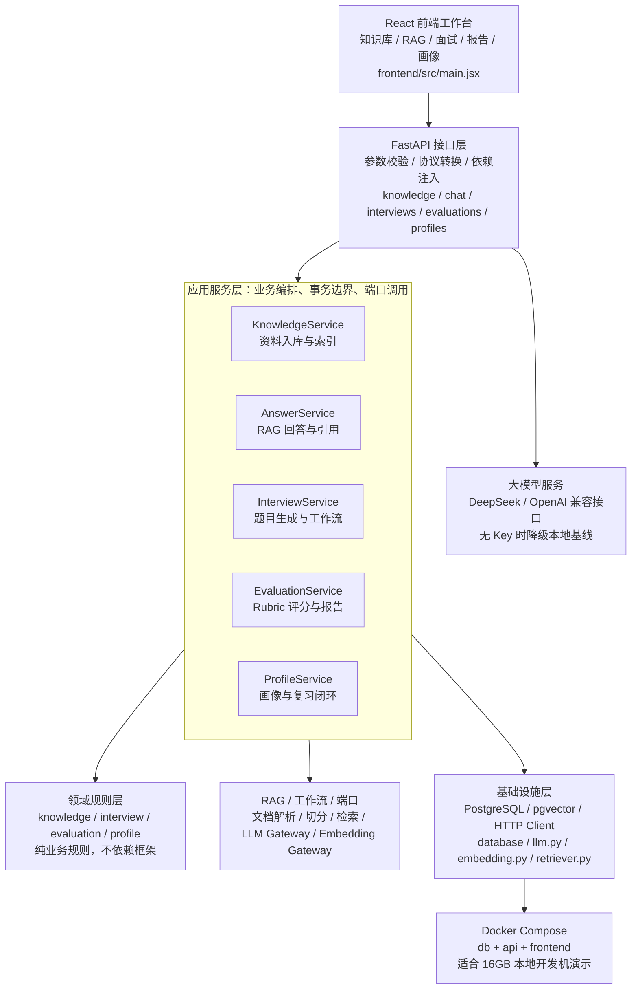
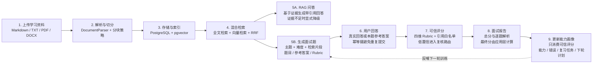
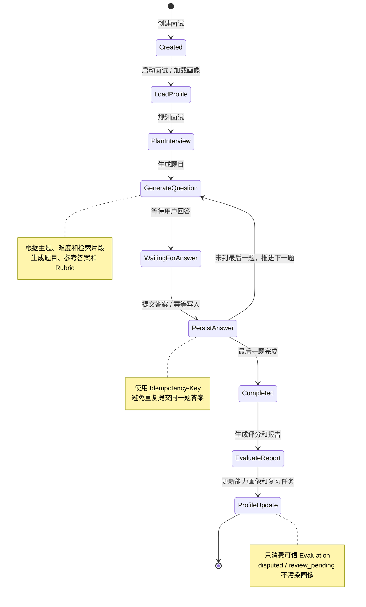

# AgentMentor V1 项目交接文档

> 交接目标：让新同事在没有参与前期设计的情况下，能在 30-60 分钟内理解项目背景、核心架构、关键流程、代码位置、运行方式、质量门禁和后续扩展方向。

## 1. 项目一句话

AgentMentor 是一个面向“Java 后端开发者转型 AI Agent 开发”的个人 AI 面试学习助手。系统把用户收集的学习资料入库，通过 RAG 提供可追溯问答，再基于资料和用户画像生成模拟面试题，对用户回答进行结构化评分，最后沉淀能力画像、错误模式、复习任务和下一轮训练建议。

核心闭环：

```text
学习资料 -> 知识库入库 -> RAG 问答验证 -> 模拟面试 -> 评分报告 -> 能力画像 -> 复习计划 -> 下一轮训练
```

## 2. 项目背景

这个项目的出发点不是做一个通用题库，而是解决个人转型学习时的几个痛点：

1. Java 后端开发者转向 AI Agent 开发时，学习资料分散在博客、官方文档、课程笔记和开源项目中。
2. 直接问大模型虽然快，但回答准确性和来源无法稳定验证。
3. 学完之后缺少“像面试官一样追问和评分”的反馈机制。
4. 错题、薄弱点、复习任务和下一轮训练经常是割裂的。
5. 个人电脑资源有限，项目必须能在 16GB 普通开发机上通过 Docker Compose 跑通，不能为了“技术栈好看”引入过重基础设施。

因此 V1 的定位是：

- 单用户本地个人助手。
- RAG 前置，回答和评分都尽量绑定资料证据。
- 面试流程可恢复、可重试。
- 评分有 Rubric、有置信度、有引用白名单。
- 画像只消费可信评分结果，避免低可信结果污染长期学习记录。
- 工程上优先稳定、可解释、可演示，不堆 Redis、Kafka、Elasticsearch、Kubernetes 等额外组件。

## 3. 当前 V1 范围

### 3.1 已实现能力

- 文档入库：Markdown、TXT、PDF、DOCX 解析、切分、去重、嵌入、pgvector 入库。
- 混合检索：PostgreSQL 全文检索 + pgvector 向量检索 + RRF 融合。
- RAG 问答：返回答案、候选片段、引用片段和证据充足标记。
- 模拟面试：创建会话、生成三题、保存 checkpoint、幂等提交答案。
- LLM Gateway：支持无 Key 本地 Fake/确定性降级，也支持 DeepSeek/OpenAI-compatible API。
- 可信评分：四维评分、Rubric 校验、引用白名单、低置信复核路由、报告生成。
- 用户画像：能力分、错误模式、复习任务、下一轮训练推荐。
- Web 演示：React + Vite 静态构建，Python 轻量服务代理 API。
- 本地部署：Docker Compose 三服务，满足普通 16GB 开发机演示约束。

### 3.2 明确非目标

- V1 不做多用户登录、权限系统和租户隔离。
- V1 不做企业级招聘平台。
- V1 不做在线教育 LMS、支付、运营后台。
- V1 不内置本地大模型推理，不依赖 GPU。
- V1 不引入分布式任务队列、搜索集群或 Kubernetes。

## 4. 总体架构图

下面是 V1 的完整结构。这里使用 Mermaid 图而不是外部 SVG 文件，避免 Windows 编码链路导致中文节点显示为乱码。



图解说明：

- 左侧是 React 前端工作台，负责把知识库、RAG 问答、面试、报告和画像组织成一个可演示界面。
- 中间是 FastAPI 接口层，只做协议转换、参数校验和依赖注入，不承载核心业务规则。
- 紫色区域是应用服务层，是接手时最需要关注的业务编排中心：资料入库、RAG 回答、面试流程、评分报告、画像闭环都在这里串联。
- 底部三块分别是领域规则层、RAG/工作流/端口层、基础设施层。维护时要守住依赖方向：领域规则不要反向依赖 FastAPI、SQLAlchemy 或具体模型 SDK。
- 右侧大模型服务通过 LLM Gateway 接入，当前支持 DeepSeek/OpenAI-compatible；无 Key 时可以降级到本地基线，方便测试和演示。
- 最底部强调工程约束：V1 用 Docker Compose 启动 db、api、frontend，目标是在 16GB 普通开发机上稳定运行。

## 5. 核心闭环流程图



图解说明：

- 上半部分是知识库链路：用户上传资料后，系统完成解析、切分、去重、向量化，并写入 PostgreSQL/pgvector。
- 中间的“混合检索”是 RAG 和面试出题共同依赖的能力，包含全文检索、向量检索和 RRF 融合。
- 检索结果有两条消费路径：一条进入 RAG 问答，生成带引用回答；另一条进入面试题生成，产出题目、参考答案和 Rubric。
- 用户回答后进入可信评分链路，系统基于四维 Rubric、引用白名单和置信度生成评分。
- 报告不仅有总分，还应展示逐题解析，说明为什么扣分、缺失哪些点、下一步怎么补。
- 最后画像更新只消费可信评分结果，沉淀能力、错误、复习任务和下一轮训练计划，再反哺下一轮面试。


## 6. 面试工作流与状态流转

面试工作流是 V1 中最像 Agent 的部分：它不是一次性请求，而是可恢复的多步骤状态机。



图解说明：

- 面试不是一次性请求，而是一个可恢复状态机：创建面试后加载画像、规划面试、生成题目、等待用户回答。
- `generate_question` 会根据主题、难度和检索片段生成题目、参考答案和 Rubric；前端可以使用用户真实回答，也可以用本题参考答案演示闭环。
- `submit_answer` 使用幂等键，避免重复点击或网络重试导致同一题重复写入。
- 每题提交后进入 `persist_answer`，然后判断是推进下一题还是完成整场面试。
- `finish_interview` 之后才进入评分和报告阶段，再触发画像更新。
- 每个关键节点都会写入 `WorkflowCheckpointModel`，这是“可恢复工作流”的核心证据，也是面试时讲 Agent 工程化能力的重点。


## 7. 代码地图

### 7.1 后端入口

| 责任 | 文件 | 说明 |
| --- | --- | --- |
| FastAPI App 初始化 | `src/agent_mentor/main.py` | 创建 app、注册路由、初始化 service 和 gateway。 |
| 健康检查 | `src/agent_mentor/api/health.py` | `/health/ready`、`/health/runtime`。 |
| 知识库 API | `src/agent_mentor/api/knowledge.py` | 创建知识库、上传文档、查看文档状态。 |
| RAG 问答 API | `src/agent_mentor/api/chat.py` | `/knowledge-bases/{id}/ask`。 |
| 面试 API | `src/agent_mentor/api/interviews.py` | 创建/启动面试、提交答案、SSE 状态。 |
| 评分 API | `src/agent_mentor/api/evaluations.py` | 评分、报告、逐题解析字段。 |
| 画像 API | `src/agent_mentor/api/profiles.py` | 能力画像、错误模式、复习任务、推荐计划。 |

### 7.2 Application Service

| Service | 文件 | 关键职责 |
| --- | --- | --- |
| `KnowledgeService` | `src/agent_mentor/application/knowledge_service.py` | 文档上传校验、存储、解析、chunk、embedding、入库。 |
| `AnswerService` | `src/agent_mentor/application/answer_service.py` | 混合检索、证据判断、LLM 回答、引用校验、聊天记录。 |
| `InterviewService` | `src/agent_mentor/application/interview_service.py` | 创建面试、生成题目、保存 checkpoint、幂等提交答案。 |
| `EvaluationService` | `src/agent_mentor/application/evaluation_service.py` | 评分、低置信复核、报告生成、逐题解析上下文。 |
| `ProfileService` | `src/agent_mentor/application/profile_service.py` | 从可信评分生成能力画像、错误模式、复习任务和下一轮计划。 |

### 7.3 RAG 与外部能力

| 责任 | 文件 | 说明 |
| --- | --- | --- |
| 文档解析 | `src/agent_mentor/rag/documents.py` | Markdown/TXT/PDF/DOCX 解析。 |
| 分块 | `src/agent_mentor/rag/chunking.py` | 按 heading path 和长度切分。 |
| 检索算法 | `src/agent_mentor/rag/retrieval.py` | 查询规范化、RRF、引用校验。 |
| 检索实现 | `src/agent_mentor/infrastructure/retriever.py` | PostgreSQL 全文检索 + pgvector 检索。 |
| Embedding | `src/agent_mentor/infrastructure/embedding.py` | Fake/轻量 embedding gateway。 |
| LLM Gateway | `src/agent_mentor/infrastructure/llm.py` | OpenAI-compatible HTTP 调用，DeepSeek 通过配置接入。 |
| Fake 能力 | `src/agent_mentor/infrastructure/fakes.py` | 测试和无 Key 降级。 |

### 7.4 Domain 与 Workflows

| 责任 | 文件 | 说明 |
| --- | --- | --- |
| 知识库枚举/规则 | `src/agent_mentor/domain/knowledge.py` | 文档状态、可信等级。 |
| 面试状态 | `src/agent_mentor/domain/interview.py` | 状态迁移、题型、难度、答案类型。 |
| 评分规则 | `src/agent_mentor/domain/evaluation.py` | Rubric、总分计算、复核路由、状态。 |
| 画像规则 | `src/agent_mentor/domain/profile.py` | 掌握度更新、错误分类、间隔复习、任务优先级。 |
| 面试 checkpoint | `src/agent_mentor/workflows/interview.py` | load_profile、plan_interview、generate_question 等状态节点。 |

### 7.5 前端

| 责任 | 文件 | 说明 |
| --- | --- | --- |
| React 主界面 | `frontend/src/main.jsx` | 工作台、上传、RAG、面试、评分报告、画像和计划展示。 |
| 样式 | `frontend/src/styles.css` | 暗色卡片、标签、折叠题目解析。 |
| 静态服务/API 代理 | `frontend/server.py` | 运行 dist，代理 `/api` 和 `/health` 到后端。 |
| 前端构建 | `frontend/package.json` | `npm.cmd run build`。 |

## 8. 数据模型概览

V1 的主要表如下：

| 领域 | 主要表 | 说明 |
| --- | --- | --- |
| 用户 | `users` | V1 固定默认用户，保留多用户扩展字段。 |
| 知识库 | `knowledge_bases`、`source_documents`、`knowledge_chunks` | 文档元数据、解析状态、chunk、全文/向量索引。 |
| RAG 问答 | `chat_sessions`、`chat_messages`、`chat_citations` | 问答历史、回答和引用。 |
| 面试 | `interview_sessions`、`interview_questions`、`question_references`、`user_answers` | 面试会话、题目、题目引用、用户答案。 |
| 工作流 | `workflow_checkpoints` | 面试节点状态快照。 |
| 评分 | `evaluations`、`evaluation_references`、`interview_reports` | 四维评分、引用、整场报告。 |
| 画像 | `ability_profiles`、`error_patterns`、`review_tasks`、`profile_update_events` | 掌握度、错误模式、复习任务、画像更新事件。 |

数据库迁移位于 `migrations/versions/`，Phase 0 到 Phase 6 已有连续 migration。

## 9. 关键设计思路

### 9.1 为什么 RAG 前置

项目不是简单包装大模型。RAG 的价值在于：

- 回答有可追溯证据。
- 面试题生成能贴近用户上传资料。
- 评分时可以校验引用范围，降低虚假溯源。
- 证据不足时系统可以明确提示，而不是强行编答案。

### 9.2 为什么总分由应用层计算

模型可以输出四维评分和反馈，但最终总分由 `domain/evaluation.py` 的规则计算。这样做有三个好处：

1. 防止模型直接决定最终成绩。
2. 分数规则可测试、可复现。
3. 面试时可以解释“为什么这样算”。

### 9.3 为什么低置信不直接更新画像

画像是长期记忆，污染后会影响后续推荐。因此：

- `FINAL` 且可信的 Evaluation 才更新画像。
- `DISPUTED` 或 `REVIEW_PENDING` 不应强更新画像。
- 画像更新有 `ProfileUpdateEventModel`，避免重复应用同一 Evaluation。

### 9.4 为什么 V1 不引入更多基础设施

项目目标是面试项目和个人可运行系统，不是基础设施展览。V1 使用：

- FastAPI 承担 API。
- PostgreSQL + pgvector 同时承担业务数据、全文检索和向量检索。
- Docker Compose 管理 db/api/frontend。
- 云端 LLM API 做真实模型能力。

不引入 Redis、Celery、Kafka、Elasticsearch、Kubernetes，是为了把复杂度控制在个人开发机可复现范围内。

## 10. 运行方式

### 10.1 环境要求

- Windows + Docker Desktop + WSL2。
- Docker Compose 可用。
- Node/npm 只用于本地构建前端；容器运行时不依赖 Node。
- Python 3.12 用于本地开发；如果 Windows 策略拦截 Python/Ruff，可用 Docker 跑测试。

### 10.2 配置

复制配置：

```powershell
Copy-Item .env.example .env
```

如果需要真实 LLM，在 `.env` 中配置 OpenAI-compatible/DeepSeek：

```env
AGENT_MENTOR_LLM_BASE_URL=https://api.deepseek.com/v1
AGENT_MENTOR_LLM_API_KEY=your_api_key
AGENT_MENTOR_LLM_DEFAULT_MODEL=deepseek-chat
```

注意：不要提交真实 `.env`。

### 10.3 启动

```powershell
docker compose up -d --build
```

访问：

- 前端：http://localhost:3000
- API 文档：http://localhost:8000/api/v1/docs
- 健康检查：http://localhost:8000/health/ready
- Runtime 检查：http://localhost:8000/health/runtime

### 10.4 停止

```powershell
docker compose down
```

如果需要清空数据库和上传卷，再执行：

```powershell
docker compose down -v
```

注意：`-v` 会删除 PostgreSQL 数据和上传文件，仅在确认可丢弃数据时使用。

## 11. 推荐演示路径

1. 打开 `http://localhost:3000`。
2. 创建知识库。
3. 上传一份 LangGraph/RAG/Agent 学习资料。
4. 等待文档状态变为 `ready`。
5. 在 RAG 问答区提问，展示引用和证据不足标记。
6. 在面试区确认“本轮面试主题”，例如 `LangGraph`。
7. 启动三题面试。
8. 手动回答，或点击“使用本题参考答案”演示闭环。
9. 完成三题后生成评分报告。
10. 展示总分、逐题折叠解析、能力画像、错误模式和下一轮训练计划。

## 12. 质量门禁

### 12.1 前端构建

```powershell
cd frontend
npm.cmd run build
```

### 12.2 后端测试

如果本机 Python 可用：

```powershell
python -m uv run pytest
python -m uv run pyright
```

如果本机 Python/Ruff 被 Windows 应用控制策略拦截，使用 Docker：

```powershell
docker run --rm -v "D:\AgentStudy\personal-rag-bot:/work" -w /work personal-rag-bot-api sh -c "python -m pip install 'pytest>=8,<9' 'pytest-asyncio>=0.24,<1.0' >/tmp/test-install.log && python -m pytest"
```

Ruff：

```powershell
docker run --rm -v "D:\AgentStudy\personal-rag-bot:/work" -w /work personal-rag-bot-api sh -c "python -m pip install 'ruff>=0.8,<1.0' >/tmp/ruff-install.log && python -m ruff check src tests migrations frontend/server.py && python -m ruff format --check src tests migrations frontend/server.py"
```

### 12.3 当前测试覆盖重点

- 架构依赖规则。
- 文档解析与 chunk。
- 检索归一化、RRF、引用校验。
- 面试状态迁移和题目去重。
- 评分、Rubric、Reviewer 路由。
- 画像更新、错误模式、复习任务。
- 健康检查和配置。

## 13. 常见问题与排障

### 13.1 `docker` 命令不存在

说明 Docker Desktop 没安装或没有加入 PATH。先安装 Docker Desktop，并确认 WSL2 已启用。

### 13.2 Docker Desktop 提示 WSL not installed

以管理员 PowerShell 执行：

```powershell
wsl --install
```

安装 Ubuntu 后重启 Docker Desktop。

### 13.3 前端页面还是旧样式

先重建前端：

```powershell
cd D:\AgentStudy\personal-rag-bot
docker compose up -d --build frontend
```

浏览器执行 `Ctrl + F5` 强刷。

### 13.4 Ruff 在 Windows 本机被拦截

这是 Windows 应用控制策略，不是代码失败。使用上面的 Docker Ruff 命令补验。

### 13.5 真实 LLM 没启用

检查：

```powershell
Invoke-RestMethod -Uri http://localhost:8000/health/runtime
```

如果 `llm_enabled=false`，检查 `.env` 中的：

- `AGENT_MENTOR_LLM_BASE_URL`
- `AGENT_MENTOR_LLM_API_KEY`
- `AGENT_MENTOR_LLM_DEFAULT_MODEL`

### 13.6 GitHub push 偶发超时

当前环境偶尔会出现 GitHub 443 连接超时或 reset。若本地 `git status -sb` 显示 `ahead 1`，说明提交已在本地，只差稍后执行：

```powershell
git push
```

## 14. 后续扩展建议

优先级从高到低：

1. 后端层面做知识点归并，而不是只在前端展示层归并。
2. 面试计划真正融合画像：先选薄弱点，再从知识库检索候选资料生成题。
3. 增加报告历史列表，让用户查看多轮训练趋势。
4. 增加文档级来源管理：来源 URL、可信等级、标签筛选。
5. 增加评分争议处理入口：用户标记“不同意评分”后进入复核队列。
6. 增加轻量导出：面试报告导出 Markdown/PDF。
7. 若未来需要多用户，再引入认证、用户隔离和权限模型。

## 15. 接手时最该先看的文件

建议按这个顺序读：

1. `README.md`
2. `docs/design/产品与架构设计.md`
3. `docs/design/V1实现规格说明.md`
4. `docs/planning/V1分阶段开发计划与验收标准.md`
5. `src/agent_mentor/main.py`
6. `src/agent_mentor/application/knowledge_service.py`
7. `src/agent_mentor/application/answer_service.py`
8. `src/agent_mentor/application/interview_service.py`
9. `src/agent_mentor/application/evaluation_service.py`
10. `src/agent_mentor/application/profile_service.py`
11. `frontend/src/main.jsx`
12. `tests/unit/`

## 16. 当前维护约定

- 真实密钥只放 `.env`，不得提交。
- 数据库变更必须有 Alembic migration。
- 核心业务规则优先放 domain/application，不放前端。
- 前端可以做展示层归并和降噪，但不应成为唯一业务真相。
- 评分和画像相关改动必须补测试，避免长期记忆被错误污染。
- 新增基础设施前必须说明收益、成本和 16GB 本地约束影响。

---

最后一句交接建议：这个项目最有价值的不是“调用了大模型”，而是把 RAG、可恢复工作流、可信评分和能力画像串成了一个可解释、可演示、可本地运行的学习闭环。后续维护时要守住这条主线。
